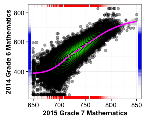

<!--SGPreport-->

```{r, echo=FALSE, include=FALSE}
  require(SGP)
  require(Gmisc)
	require(ggplot2)
	require(data.table)

  ## set a universal Cache path
  knitr::opts_chunk$set(cache.path = "_cache/Appendix_C_2015", fig.path="../img/Appendices/Appendix_C_2015/")

  ##  Set Table, Figure and Equation Counters
  options(table_counter=FALSE)
  options(table_number=0)
  options(table_counter_str = "<strong>Table C.%s:</strong> ")
  options("fig_caption_no"=0)
  options(fig_caption_no_sprintf = "**Fig. C.%s:**   %s")
  options("fig_caption_no_roman"=FALSE)
	options("equation_counter" = 0)
	
  subject_order<-c("ELA", "MATHEMATICS", 
									 "ALGEBRA_I", "ALGEBRA_II", "GEOMETRY", "INTEGRATED_MATH_1", "INTEGRATED_MATH_2", "INTEGRATED_MATH_3")
	GL_subjects <- c("ELA", "MATHEMATICS")
	EOCT_subjects<-c("ALGEBRA_I", "ALGEBRA_II", "GEOMETRY", "INTEGRATED_MATH_1", "INTEGRATED_MATH_2", "INTEGRATED_MATH_3")
	
	prior.year <- "2014"
	current.year <- "2015"

	###  Set up long data
	long.data <- copy(Colorado_SGP@Data[, c("ID", "VALID_CASE", "CONTENT_AREA", "GRADE", "Most_Recent_Prior", "YEAR", "SCALE_SCORE", "SGP", "SCALE_SCORE_PRIOR", "SCALE_SCORE_PRIOR_STANDARDIZED", "SGP_NORM_GROUP", "SGP_NORM_GROUP_SCALE_SCORES"), with=FALSE][VALID_CASE=="VALID_CASE" & YEAR %in% c(prior.year, current.year)]) #"ACHIEVEMENT_LEVEL",  

	setkeyv(long.data, c("CONTENT_AREA", "YEAR", "GRADE", "Most_Recent_Prior", "SCALE_SCORE"))

	loss.hoss <- long.data[YEAR == current.year & !is.na(SGP)][, list(
		LOSS_50 = SCALE_SCORE[which.min(SCALE_SCORE)+49], #  Bottom 50 Scores
		LOSS_1 = min(SCALE_SCORE),   #  LOSS Only
		HOSS_50 = SCALE_SCORE[which.max(SCALE_SCORE)-49], #  TOP 50 Scores
		HOSS_1 = max(SCALE_SCORE)   #  HOSS Only
		), keyby=list(CONTENT_AREA, YEAR, GRADE, Most_Recent_Prior)]

	setkeyv(long.data, c("CONTENT_AREA", "YEAR", "GRADE", "Most_Recent_Prior"))
	long.data <- merge(long.data, loss.hoss, all.x = TRUE)
	long.data[, Grade := ordered(GRADE, levels=c(3:11, "EOCT"))]
	long.data[, CA := ordered(CONTENT_AREA, levels=subject_order, labels=sapply(subject_order, capwords, USE.NAMES = FALSE))]

	my.tmp.split.scale_score <- strsplit(long.data$SGP_NORM_GROUP_SCALE_SCORES, "; ")
	long.data$SCALE_SCORE_PRIOR_1 <- as.numeric(sapply(my.tmp.split.scale_score, function(x) rev(x)[2]))
	long.data$SCALE_SCORE_PRIOR_2 <- as.numeric(sapply(my.tmp.split.scale_score, function(x) rev(x)[3]))
	long.data$SCALE_SCORE_PRIOR_3 <- as.numeric(sapply(my.tmp.split.scale_score, function(x) rev(x)[4]))
	long.data$SCALE_SCORE_PRIOR_4 <- as.numeric(sapply(my.tmp.split.scale_score, function(x) rev(x)[5]))
	long.data$SCALE_SCORE_PRIOR_5 <- as.numeric(sapply(my.tmp.split.scale_score, function(x) rev(x)[6]))
	long.data$SCALE_SCORE_PRIOR_6 <- as.numeric(sapply(my.tmp.split.scale_score, function(x) rev(x)[7]))

	getECDF <- function(ss) {
		if(!all(is.na(ss))) {
			Fn <- ecdf(ss)
			return(Fn(ss))
		} else return(ss)
	}
	
# 	long.data[, Quant_SS1 := round(getECDF(SCALE_SCORE_PRIOR_1), 3), by = c("YEAR", "CONTENT_AREA", "GRADE", "Most_Recent_Prior")]
# 	long.data[, Quant_SS2 := round(getECDF(SCALE_SCORE_PRIOR_2), 3), by = c("YEAR", "CONTENT_AREA", "GRADE", "Most_Recent_Prior")]
# 	long.data[, Quant_SS3 := round(getECDF(SCALE_SCORE_PRIOR_3), 3), by = c("YEAR", "CONTENT_AREA", "GRADE", "Most_Recent_Prior")]
# 	long.data[, Quant_SS4 := round(getECDF(SCALE_SCORE_PRIOR_4), 3), by = c("YEAR", "CONTENT_AREA", "GRADE", "Most_Recent_Prior")]
# 	long.data[, Quant_SS5 := round(getECDF(SCALE_SCORE_PRIOR_5), 3), by = c("YEAR", "CONTENT_AREA", "GRADE", "Most_Recent_Prior")]
# 	long.data[, Quant_SS6 := round(getECDF(SCALE_SCORE_PRIOR_6), 3), by = c("YEAR", "CONTENT_AREA", "GRADE", "Most_Recent_Prior")]
# 
# 	long.data[, Quant_SS1 := round(pnorm(scale(SCALE_SCORE_PRIOR_1))*100, 3), by = c("YEAR", "CONTENT_AREA", "GRADE", "Most_Recent_Prior")]
# 	long.data[, Quant_SS2 := round(pnorm(scale(SCALE_SCORE_PRIOR_2))*100, 3), by = c("YEAR", "CONTENT_AREA", "GRADE", "Most_Recent_Prior")]
# 	long.data[, Quant_SS3 := round(pnorm(scale(SCALE_SCORE_PRIOR_3))*100, 3), by = c("YEAR", "CONTENT_AREA", "GRADE", "Most_Recent_Prior")]
# 	long.data[, Quant_SS4 := round(pnorm(scale(SCALE_SCORE_PRIOR_4))*100, 3), by = c("YEAR", "CONTENT_AREA", "GRADE", "Most_Recent_Prior")]
# 	long.data[, Quant_SS5 := round(pnorm(scale(SCALE_SCORE_PRIOR_5))*100, 3), by = c("YEAR", "CONTENT_AREA", "GRADE", "Most_Recent_Prior")]
# 	long.data[, Quant_SS6 := round(pnorm(scale(SCALE_SCORE_PRIOR_6))*100, 3), by = c("YEAR", "CONTENT_AREA", "GRADE", "Most_Recent_Prior")]
# 	
# 	long.data[, Prior_Quantiles := paste(format(Quant_SS6), format(Quant_SS5), format(Quant_SS4), format(Quant_SS3), format(Quant_SS2), format(Quant_SS1), sep="; ")]
# 	long.data[, Prior_Quantiles := gsub("NA; ", "", Prior_Quantiles)]
# 	long.data[YEAR == current.year & !is.na(Quant_SS2)][, as.list(round(summary(Quant_SS2), 3)), keyby=list(YEAR, CONTENT_AREA, GRADE, Most_Recent_Prior)]
# 	long.data[YEAR == current.year & !is.na(Most_Recent_Prior)][, as.list(quantile(as.numeric(SCALE_SCORE_PRIOR_1), probs = seq(0.01, 0.99, 0.1), na.rm = TRUE)), keyby=list(YEAR, CONTENT_AREA, GRADE, Most_Recent_Prior)]

	##  Subset out all students with max score and their historical long data

	max.data <- data.table(long.data[SCALE_SCORE >= HOSS_50 & !is.na(SGP),], key=c("ID", "CONTENT_AREA", "GRADE", "Most_Recent_Prior"))
	max.data[, CA := gsub("Sec ", "Secondary ", sapply(CONTENT_AREA, capwords))]
	min.data <- data.table(long.data[SCALE_SCORE <= LOSS_50 & !is.na(SGP),], key=c("ID", "CONTENT_AREA", "GRADE", "Most_Recent_Prior"))
	min.data[, CA := gsub("Sec ", "Secondary ", sapply(CONTENT_AREA, capwords))]

	###
	###  Utility functions for ggplot (necessary because use of ggplot(...) withing knitr is odd - can't find defined variables in envir/scope, just like data.table)
	###
	
	condDistPlot <- function(ca, g, prior.ca = NULL) {
		if (g == "EOCT") {
			tmp.data <- subset(long.data, YEAR==current.year & CONTENT_AREA==ca & Most_Recent_Prior==prior.ca & !is.na(SCALE_SCORE_PRIOR), select=c(ID, SCALE_SCORE, SCALE_SCORE_PRIOR))
			x.lab <- paste(current.year, gsub("Sec ", "Secondary ", capwords(ca)))
			y.lab <- paste(c(sapply(strsplit(prior.ca, "/")[[1]], capwords)), collapse = " ") #"First Prior:", 
			y.lab <- gsub(" Eoct", "", y.lab)
			y.lab <- gsub(" 8", " Grade 8", y.lab)
			y.lab <- gsub(" 7", " Grade 7", y.lab)
			y.lab <- gsub(" 6", " Grade 6", y.lab)
		}	else {
			tmp.data <- subset(long.data, YEAR==current.year & CONTENT_AREA==ca & GRADE==g & !is.na(SCALE_SCORE_PRIOR), select=c(ID, SCALE_SCORE, SCALE_SCORE_PRIOR))
			x.lab <- paste(current.year, "Grade", g, capwords(ca))
			if (is.null(prior.ca)) prior.ca <- ca
			y.lab <- paste(prior.year, "Grade", g-1, capwords(prior.ca))
		}

		ggplot(tmp.data, aes(x=SCALE_SCORE, y=SCALE_SCORE_PRIOR)) + geom_point(alpha=0.35) + theme_bw() + 
			geom_smooth(aes(x=SCALE_SCORE), colour='magenta', method="gam", formula =y ~ s(x, bs = "cs")) + 
			geom_rug(sides="tb", size=0.05, col=rgb(0.8,0,0,alpha=0.05)) + geom_rug(sides="rl", size=0.05, col=rgb(0,0,0.8,alpha=0.05)) +
			stat_density2d(data=tmp.data, geom="density2d",  aes(alpha = ..level..), colour='green', contour = TRUE) + #, size=1
			labs(y = y.lab, x = x.lab) + theme(axis.title=element_text(size=10, face="bold"), legend.position="none")
	}

	boxPlot <- function(tmp.data, y, LOSS=FALSE, facet=NULL) {
		give.n <- function(x) { return(c(y = y, label = length(x))) }
		if (is.null(facet)) {
			if (LOSS) {
				p <- ggplot(data=tmp.data, aes(x=CA, y=SGP, fill=CA, ymax=(min(SGP) +7))) + 
						 geom_boxplot() + labs(x="Content Area", y="Lowest Scoring Students' Growth Percentiles")
			} else {
				p <- ggplot(data=tmp.data, aes(x=CA, y=SGP, fill=CA, ymax=(min(SGP) -7))) + 
						 geom_boxplot() + labs(x="Content Area", y="Highest Scoring Students' Growth Percentiles")
			}
			p + stat_summary(fun.data = give.n, geom = "text", position=position_dodge(width = 0.75), size=4, colour="red") +
					coord_flip() + theme(axis.title=element_text(size=12,face="bold"), legend.position="none")
		} else {
		if (facet=="Grade") {
			if (LOSS) {
				p <- ggplot(data=tmp.data, aes(x=CA, y=SGP, fill=Grade, ymax=(min(SGP) +7))) + 
						 geom_boxplot() + facet_grid(.~CA, scales="free") + labs(x="", y="Lowest Scoring Students' Growth Percentiles") 
			} else {
				p <- ggplot(data=tmp.data, aes(x=CA, y=SGP, fill=Grade, ymax=(min(SGP) -7))) + 
						 geom_boxplot() + facet_grid(.~CA, scales="free") + labs(x="", y="Highest Scoring Students' Growth Percentiles") 
			}
			p + stat_summary(fun.data = give.n, geom = "text", position=position_dodge(0.75), size=4, colour="red") +
					coord_flip() + theme(axis.title=element_text(size=12,face="bold"), axis.text.y = element_blank()) # +
		} else {
			###  Facet is either Grade or Most_Recent_Prior
			if (LOSS) {
				p <- ggplot(data=tmp.data, aes(x=CA, y=SGP, fill=Most_Recent_Prior, ymax=(min(SGP) +7))) + 
						 geom_boxplot() + facet_grid(.~CA, scales="free") + labs(x="", y="Lowest Scoring Students' Growth Percentiles") 
			} else {
				p <- ggplot(data=tmp.data, aes(x=CA, y=SGP, fill=Most_Recent_Prior, ymax=(min(SGP) -7))) + 
						 geom_boxplot() + facet_grid(.~CA, scales="free") + labs(x="", y="Highest Scoring Students' Growth Percentiles") 
			}
			p + stat_summary(fun.data = give.n, geom = "text", position=position_dodge(0.75), size=4, colour="red") +
					coord_flip() + theme(axis.title=element_text(size=12,face="bold"), axis.text.y = element_blank()) # +
		}}
	}
```


# Introduction
In the 2014-2015 academic year, Colorado transitioned from the Transitional Colorado Assessment Program (TCAP) to the [Colorado Measures of Academic Success (CMAS)](https://www.cde.state.co.us/communications/factsheetsandfaqs-assessment#cmas).  The transition included numerous changes to the assessment system including the incorporation of new performance standards.  As other states have gone through similar assessment transitions, many have observed ceiling and floor effects in the new assessments (i.e. a relatively large proportion of students scoring at/near the scale extremes).  This has occurred despite purported improvements in assessment qualities that should prevent these effects (e.g. adaptive tests).  Regardless of the source of assessment ceilings/floors, they can telegraph onto the Student Growth Percentile (SGP) calculations making these estimates questionable.

Although very similar in nature, ceiling effects are somewhat more problematic than floor effects because students that consistently achieve the highest scores receive lower than expected growth percentiles and are therefore negatively impacted.  Conversely, the consistently lowest achieving students have higher estimated SGPs than would be expected.  Although this could be interpreted as a positive impact for these students by giving them higher SGPs, it can also conceal unacceptably low growth that needs to be identified and addressed.

Essentially these problems are caused by the way in which a "percentile" is defined to begin with, and the inability of the assessments (and therefore the SGP model) to make granular distinctions between kids who score at the extremes of the test year after year.  As an example, if a group of students were tested with a relatively easy test and 20% of the students had a perfect score, these students would be defined as being in the 80<sup>th</sup> percentile because they scored higher than 80% of their peers.  This is somewhat misleading however, because their score was *equal to* or greater than 100% of their peers and so could be also described as achieving at the 99.99<sup>th</sup> percentile under an equally valid definition.

To extend this heuristic from achievement to growth, if 50% of those top students also scored perfectly on the next test, we might estimate that they had 50<sup>th</sup> percentile growth.  Although there is nothing *technically* incorrect about this estimate because their growth is fairly typical for their academic peer group, it is an inadequate or unsatisfactory assessment of their growth because they have consistently attained at the highest observable level.  Furthermore, if it is typical for their peers to maintain perfect scores then even small deviations from a perfect score could produce *low growth* SGP estimates.  Ideally, the expectation is that the majority of SGPs for students scoring at or near the lowest obtainable scale score (LOSS) will be low (preferably less than 5 and not higher than 10), and that SGPs for students with the highest obtainable scale score (HOSS) will be high (higher than 95 and not less than 90).

Given these impacts and the difficulty in detecting them using traditional SGP diagnostic tools, the Center for Assessment has added "Ceiling/Test Effects" indicators to the SGP model goodness of fit plots and is providing all clients even more rigorous diagnostic and descriptive analyses through this Appendix to the annual technical report.  This report includes:

1. Plots of the scale score distributions for the current and prior years' tests, which may provide an indication of whether a ceiling or floor is present in either (or both) the current or historical data.
2. Box plots showing the range and distribution of SGPs for *only* the highest and lowest achieving students in the current year.

<!-- HTML_Start -->
<!-- <div class='breakboth' ></div> -->
<!-- LaTeX_Start 
\pagebreak
LaTeX_End -->


# Prior and Current Year Score Distributions
The marginal and conditional distributions of scale scores can serve as a preliminary indicator of potential ceiling or floor effects in the calculation of student growth percentiles.  Some minor problems could present themselves if these characteristics are present in either prior or current year scores, and are particularly likely when present in both.  The plots below depict distributions for the current year and the most recent prior year used in the SGP calculations.  The marginal (individual or univariate) distributions for each year are shown in the first subsections below, followed by the conditional (joint) distributions.  Each content area plots are disaggregated by grade.

## Marginal Distributions
Generally there is little evidence of floor/ceiling effects in the TCAP prior scores.  When present, these effects appear either as sharp spikes at the extremes of the distributions or as fat, truncated tails.  

The CMAS scores are truncated at the floor in some grades and end-of-course test (EOCT) subjects.  This could potentially translate to floor effects in growth analyses.  No evidence of ceiling effects are present in the marginal distributions alone.

```{r, echo=FALSE, include=FALSE, margDist_Prior, cache=TRUE, fig.height=3.75, fig.width=7}
#  Loop around subjects to produce plots: - NOPE!  For some reason for loops don't work in knitr ...  No plots produced in code chunk
	ggplot(data=data.table(long.data[CONTENT_AREA=="WRITING" & YEAR == prior.year & GRADE %in% 3:10,][, list(ID, SCALE_SCORE, Grade)], key=c("ID", "SCALE_SCORE")), 
			 aes(x= SCALE_SCORE, y = ..count..)) + geom_density(alpha=0.5, fill=rgb(0,0,0.8)) + facet_wrap(~ Grade, scales="free_x", ncol=3) + 
		labs(x='\nPrior Year Scale Scores') + theme(axis.title=element_text(size=12,face="bold"), legend.position = "none") 
	ggplot(data=data.table(long.data[CONTENT_AREA=="READING" & YEAR == prior.year & GRADE %in% 3:10,][, list(ID, SCALE_SCORE, Grade)], key=c("ID", "SCALE_SCORE")), 
			 aes(x= SCALE_SCORE, y = ..count..)) + geom_density(alpha=0.5, fill=rgb(0,0,0.8)) + facet_wrap(~ Grade, scales="free_x", ncol=3) + 
		labs(x='\nPrior Year Scale Scores') + theme(axis.title=element_text(size=12,face="bold"), legend.position = "none") 

	ggplot(data=data.table(long.data[CONTENT_AREA=="MATHEMATICS" & YEAR == prior.year & GRADE %in% 3:10,][, list(ID, SCALE_SCORE, Grade)], key=c("ID", "SCALE_SCORE")), 
			 aes(x= SCALE_SCORE, y = ..count..)) + geom_density(alpha=0.5, fill=rgb(0,0,0.8)) + facet_wrap(~ Grade, scales="free_x", ncol=3) + 
		labs(x='\nPrior Year Scale Scores') + theme(axis.title=element_text(size=12,face="bold"), legend.position = "none") 
```
```{r, echo=FALSE, include=FALSE, margDist_Crnt, cache=TRUE, fig.height=3.75, fig.width=7}
	ggplot(data=data.table(long.data[CONTENT_AREA=="ELA" & YEAR == current.year & GRADE %in% 3:11,][, list(ID, SCALE_SCORE, Grade)], key=c("ID", "SCALE_SCORE")), 
			 aes(x= SCALE_SCORE, y = ..count..)) + geom_density(alpha=0.5, fill=rgb(0.8,0,0)) + facet_wrap(~ Grade, scales="free_x", ncol=3) + 
		labs(x='\nCurrent Year Scale Scores') + theme(axis.title=element_text(size=12,face="bold"), legend.position = "none") 

	ggplot(data=data.table(long.data[CONTENT_AREA=="MATHEMATICS" & YEAR == current.year & GRADE %in% 3:8,][, list(ID, SCALE_SCORE, Grade)], key=c("ID", "SCALE_SCORE")), 
			 aes(x= SCALE_SCORE, y = ..count..)) + geom_density(alpha=0.5, fill=rgb(0.8,0,0)) + facet_wrap(~ Grade, scales="free_x", ncol=3) + 
		labs(x='\nCurrent Year Scale Scores') + theme(axis.title=element_text(size=12,face="bold"), legend.position = "none") 

	ggplot(data=data.table(long.data[CONTENT_AREA %in% EOCT_subjects & YEAR == current.year,][, list(ID, SCALE_SCORE, CA)], key=c("ID", "SCALE_SCORE")), 
			 aes(x= SCALE_SCORE, y = ..count..)) + geom_density(alpha=0.5, fill=rgb(0.8,0,0)) + facet_wrap(~ CA, scales="free_x", ncol=3) + 
		labs(x='\nCurrent Year Scale Scores') + theme(axis.title=element_text(size=12,face="bold"), legend.position = "none") 

```


### ELA

<!-- HTML_Start -->
##### `r figCapNo("Marginal distributions of prior scale scores: Reading.")`


##### `r figCapNo("Marginal distributions of prior scale scores: Writing.")`


##### `r figCapNo("Marginal distributions of current scale scores: ELA.")`


<!-- LaTeX_Start 
\begin{figure}[H]
\caption*{\label{fig:Bidensity} {\bf{Fig. C.1:}} Marginal distributions of prior scale scores: Reading.}
  \begin{subfigure}[b]{\textwidth}
    \includegraphics[width=\textwidth]{../img/Appendices/Appendix_C_2015/margDist_Prior-1.png}
  \end{subfigure}
\end{figure}

\begin{figure}[H]
\caption*{\label{fig:Bidensity} {\bf{Fig. C.2:}} Marginal distributions of prior scale scores: Writing}
  \begin{subfigure}[b]{\textwidth}
    \includegraphics[width=\textwidth]{../img/Appendices/Appendix_C_2015/margDist_Prior-2.png}
  \end{subfigure}
\end{figure}

\begin{figure}[H]
\caption*{\label{fig:Bidensity} {\bf{Fig. C.3:}} Marginal distributions of current scale scores: ELA.}
  \begin{subfigure}[b]{\textwidth}
    \includegraphics[width=\textwidth]{../img/Appendices/Appendix_C_2015/margDist_Crnt-1.png}
  \end{subfigure}
\end{figure}

\pagebreak
LaTeX_End -->


###  Mathematics

<!-- HTML_Start -->
##### `r figCapNo("Marginal distributions of prior scale scores: Mathematics.")`


##### `r figCapNo("Marginal distributions of current scale scores: Mathematics.")`


<!-- LaTeX_Start 
\begin{figure}[H]
\caption*{\label{fig:Bidensity} {\bf{Fig. C.4:}} Marginal distributions of prior scale scores: Mathematics.}
  \begin{subfigure}[b]{\textwidth}
    \includegraphics[width=\textwidth]{../img/Appendices/Appendix_C_2015/margDist_Prior-2.png}
  \end{subfigure}
\end{figure}

\begin{figure}[H]
\caption*{\label{fig:Bidensity} {\bf{Fig. C.5:}} Marginal distributions of current scale scores: Mathematics.}
  \begin{subfigure}[b]{\textwidth}
    \includegraphics[width=\textwidth]{../img/Appendices/Appendix_C_2015/margDist_Crnt-2.png}
  \end{subfigure}
\end{figure}

\pagebreak
LaTeX_End -->


###  End-of-Course Test Subjects

Only the current year distributions are presented here because this is the first year of CMAS testing in EOCT subjects in Colorado.

<!-- HTML_Start -->
##### `r figCapNo("Marginal distributions of current scale scores: End-of-Course Subjects.")`


<!-- LaTeX_Start 
\begin{figure}[H]
\caption*{\label{fig:Bidensity} {\bf{Fig. C.6:}} Marginal distributions of current scale scores: End-of-Course Subjects.}
  \begin{subfigure}[b]{\textwidth}
    \includegraphics[width=\textwidth]{../img/Appendices/Appendix_C_2015/margDist_Crnt-3.png}
  \end{subfigure}
\end{figure}

\pagebreak
LaTeX_End -->


## Conditional Distributions
The marginal density plots provide a limited amount of information, particularly for the potential for ceiling/floor effects in the calculation of ***growth***.  In order to provide a more nuanced view of the relationship between the prior and current scale scores, the following plots depict the conditional (joint) distributions for each content area and grade level.  These plots start with a basic scatter plot of each student's scores, and on top of this is layered 1) **green contour lines** to provide a sense of the joint density, 2) a **magenta non-linear line** identifying the bivariate relationship between prior and current scores, and 3) **rug plots** that describe the marginal distributions (as above, the prior scores are blue and current scores are red).  

Ceiling or floor effects often appear as dark shaded points in the extreme top-right or bottom-left corners of the plots.  This suggests that staying at the extremes from year to year is not uncommon, which may lead to odd growth estimates for these chronically high/low achieving students.  For the 2014 and 2015 Colorado data, we begin to see concerning indicators in most content area and grade combinations.  Along with the tell-tale points in the extremes, we also see situations in some EOCT course progressions where data is sparse in the upper extremes.  In these cases there can also be ceiling impacts for the one or two outliers with consistently high achievement (see for example the bottom left panel of Figure C.11 for Algebra I with 9<sup>th</sup> grade math priors).


```{r, echo=FALSE, include=FALSE, cache=TRUE, condDist_EOGT, fig.height=2.5, fig.width=3}
#  Loop around subjects to produce plots:
	condDistPlot(ca="ELA", g=4, prior.ca="Writing")
	condDistPlot(ca="ELA", g=5, prior.ca="Writing")
	condDistPlot(ca="ELA", g=6, prior.ca="Writing")
	condDistPlot(ca="ELA", g=7, prior.ca="Writing")
	condDistPlot(ca="ELA", g=8, prior.ca="Writing")
	condDistPlot(ca="ELA", g=9, prior.ca="Writing")
	condDistPlot(ca="ELA", g=10, prior.ca="Writing")
	condDistPlot(ca="ELA", g=11, prior.ca="Writing")

	condDistPlot(ca="MATHEMATICS", g=4)
	condDistPlot(ca="MATHEMATICS", g=5)
	condDistPlot(ca="MATHEMATICS", g=6)
	condDistPlot(ca="MATHEMATICS", g=7)
	condDistPlot(ca="MATHEMATICS", g=8)
```

###  ELA

<!-- HTML_Start -->
###### `r figCapNo("Conditional distribution(s) of current and prior scale scores: ELA.")`
  


###### `r figCapNo("Conditional distribution(s) of current and prior scale scores: ELA <em>Continued</em>.")`
 
 
 

<!-- LaTeX_Start 
\begin{figure}[H]
\caption*{\label{fig:condDistELA} {\bf{Fig. C.7:}} Conditional distribution(s) of current and prior scale scores: ELA.}
  \begin{subfigure}[b]{0.5\textwidth}
    \includegraphics[width=\textwidth]{../img/Appendices/Appendix_C_2015/condDist_EOGT-1.png}
  \end{subfigure}
  \begin{subfigure}[b]{0.5\textwidth}
    \includegraphics[width=\textwidth]{../img/Appendices/Appendix_C_2015/condDist_EOGT-2.png}
  \end{subfigure}
\end{figure}

\begin{figure}[H]
\caption*{\label{fig:condDistELA2} {\bf{Fig. C.8:}} Conditional distribution(s) of current and prior scale scores: ELA \textit{Continued}.}
  \begin{subfigure}[b]{0.475\textwidth}
    \includegraphics[width=\textwidth]{../img/Appendices/Appendix_C_2015/condDist_EOGT-3.png}
  \end{subfigure}
  \begin{subfigure}[b]{0.475\textwidth}
    \includegraphics[width=\textwidth]{../img/Appendices/Appendix_C_2015/condDist_EOGT-4.png}
  \end{subfigure}
  %
  \begin{subfigure}[b]{0.475\textwidth}
    \includegraphics[width=\textwidth]{../img/Appendices/Appendix_C_2015/condDist_EOGT-5.png}
  \end{subfigure}
  \begin{subfigure}[b]{0.475\textwidth}
    \includegraphics[width=\textwidth]{../img/Appendices/Appendix_C_2015/condDist_EOGT-6.png}
  \end{subfigure}
  %
  \begin{subfigure}[b]{0.475\textwidth}
    \includegraphics[width=\textwidth]{../img/Appendices/Appendix_C_2015/condDist_EOGT-7.png}
  \end{subfigure}
  \begin{subfigure}[b]{0.475\textwidth}
    \includegraphics[width=\textwidth]{../img/Appendices/Appendix_C_2015/condDist_EOGT-8.png}
  \end{subfigure}
\end{figure}

\pagebreak

LaTeX_End -->


###  Mathematics

<!-- HTML_Start -->
##### `r figCapNo("Conditional distribution(s) of current and prior scale scores: Mathematics.")`
  
 


<!-- LaTeX_Start 
\begin{figure}[H]
\caption*{\label{fig:condDistMath} {\bf{Fig. C.9:}} Conditional distribution(s) of current and prior scale scores: Mathematics.}
  \begin{subfigure}[b]{0.5\textwidth}
    \includegraphics[width=\textwidth]{../img/Appendices/Appendix_C_2015/condDist_EOGT-9.png}
  \end{subfigure}
  \begin{subfigure}[b]{0.5\textwidth}
    \includegraphics[width=\textwidth]{../img/Appendices/Appendix_C_2015/condDist_EOGT-10.png}
  \end{subfigure}
  %
  \begin{subfigure}[b]{0.5\textwidth}
    \includegraphics[width=\textwidth]{../img/Appendices/Appendix_C_2015/condDist_EOGT-11.png}
  \end{subfigure}
  \begin{subfigure}[b]{0.5\textwidth}
    \includegraphics[width=\textwidth]{../img/Appendices/Appendix_C_2015/condDist_EOGT-12.png}
  \end{subfigure}
  %
  \begin{subfigure}[b]{0.5\textwidth}
    \includegraphics[width=\textwidth]{../img/Appendices/Appendix_C_2015/condDist_EOGT-13.png}
  \end{subfigure}
\end{figure}

\pagebreak
LaTeX_End -->

###  End-of-Course Test Subjects

The conditional density plots for the EOCT subjects are displayed below.  The most recent prior is used in each plot to provide insight on each academic peer (norm) group that were analyzed separately.  Note the bottom left plot in Figure C.11 below for Algebra I, particularly the point in the upper-right hand area of the plot.  This is a potential indicator for a ceiling effect issue.  Several other individual plots in other subjects also display a similar indicators.

```{r, echo=FALSE, include=FALSE, cache=TRUE, condDist_EOCT, fig.height=3, fig.width=3}
	condDistPlot(ca="ALGEBRA_I", g="EOCT", prior.ca="2014/MATHEMATICS_7")
	condDistPlot(ca="ALGEBRA_I", g="EOCT", prior.ca="2014/MATHEMATICS_8")
	condDistPlot(ca="ALGEBRA_I", g="EOCT", prior.ca="2014/MATHEMATICS_9")

	condDistPlot(ca="ALGEBRA_II", g="EOCT", prior.ca="2014/MATHEMATICS_9")
	condDistPlot(ca="ALGEBRA_II", g="EOCT", prior.ca="2014/MATHEMATICS_10")

	condDistPlot(ca="GEOMETRY", g="EOCT", prior.ca="2014/MATHEMATICS_8")
	condDistPlot(ca="GEOMETRY", g="EOCT", prior.ca="2014/MATHEMATICS_9")
	condDistPlot(ca="GEOMETRY", g="EOCT", prior.ca="2014/MATHEMATICS_10")
	
	condDistPlot(ca="INTEGRATED_MATH_1", g="EOCT", prior.ca="2014/MATHEMATICS_8")

	condDistPlot(ca="INTEGRATED_MATH_2", g="EOCT", prior.ca="2014/MATHEMATICS_9")

	condDistPlot(ca="INTEGRATED_MATH_3", g="EOCT", prior.ca="2014/MATHEMATICS_10")
```


<!-- HTML_Start -->
##### `r figCapNo("Conditional distribution(s) of current and prior scale scores: Algebra I.")`
  


<!-- LaTeX_Start 
\begin{figure}[H]
\caption*{\label{fig:condDistG9L} {\bf{Fig. C.11:}} Conditional distribution(s) of current and prior scale scores: Algebra I.}
  \begin{subfigure}[b]{0.5\textwidth}
    \includegraphics[width=\textwidth]{../img/Appendices/Appendix_C_2015/condDist_EOCT-1.png}
  \end{subfigure}
  \begin{subfigure}[b]{0.5\textwidth}
    \includegraphics[width=\textwidth]{../img/Appendices/Appendix_C_2015/condDist_EOCT-2.png}
  \end{subfigure}
  %
  \begin{subfigure}[b]{0.5\textwidth}
    \includegraphics[width=\textwidth]{../img/Appendices/Appendix_C_2015/condDist_EOCT-3.png}
  \end{subfigure}
\end{figure}

\pagebreak
LaTeX_End -->


<!-- HTML_Start -->
##### `r figCapNo("Conditional distribution(s) of current and prior scale scores: Algebra II.")`
  

<!-- LaTeX_Start 
\begin{figure}[H]
\caption*{\label{fig:condDistG9L} {\bf{Fig. C.12:}} Conditional distribution(s) of current and prior scale scores: Algebra II.}
  \begin{subfigure}[b]{0.5\textwidth}
    \includegraphics[width=\textwidth]{../img/Appendices/Appendix_C_2015/condDist_EOCT-4.png}
  \end{subfigure}
  \begin{subfigure}[b]{0.5\textwidth}
    \includegraphics[width=\textwidth]{../img/Appendices/Appendix_C_2015/condDist_EOCT-5.png}
  \end{subfigure}
\end{figure}

\pagebreak
LaTeX_End -->


<!-- HTML_Start -->
##### `r figCapNo("Conditional distribution(s) of current and prior scale scores: Geometry.")`
  


<!-- LaTeX_Start 
\begin{figure}[H]
\caption*{\label{fig:condDistG9L} {\bf{Fig. C.13:}} Conditional distribution(s) of current and prior scale scores: Geometry.}
  \begin{subfigure}[b]{0.5\textwidth}
    \includegraphics[width=\textwidth]{../img/Appendices/Appendix_C_2015/condDist_EOCT-6.png}
  \end{subfigure}
  \begin{subfigure}[b]{0.5\textwidth}
    \includegraphics[width=\textwidth]{../img/Appendices/Appendix_C_2015/condDist_EOCT-7.png}
  \end{subfigure}
  %
  \begin{subfigure}[b]{0.5\textwidth}
    \includegraphics[width=\textwidth]{../img/Appendices/Appendix_C_2015/condDist_EOCT-8.png}
  \end{subfigure}
\end{figure}

\pagebreak
LaTeX_End -->


<!-- HTML_Start -->
##### `r figCapNo("Conditional distribution(s) of current and prior scale scores: Integrated Math 1.")`


<!-- LaTeX_Start 
\begin{figure}[H]
\caption*{\label{fig:condDistG9L} {\bf{Fig. C.14:}} Conditional distribution(s) of current and prior scale scores: Integrated Math 1.}
  \begin{subfigure}[b]{0.75\textwidth}
    \includegraphics[width=\textwidth]{../img/Appendices/Appendix_C_2015/condDist_EOCT-9.png}
  \end{subfigure}
\end{figure}

LaTeX_End -->


<!-- HTML_Start -->
##### `r figCapNo("Conditional distribution(s) of current and prior scale scores: Integrated Math 2.")`


<!-- LaTeX_Start 
\begin{figure}[H]
\caption*{\label{fig:condDistG9L} {\bf{Fig. C.15:}} Conditional distribution(s) of current and prior scale scores: Integrated Math 2.}
  \begin{subfigure}[b]{0.75\textwidth}
    \includegraphics[width=\textwidth]{../img/Appendices/Appendix_C_2015/condDist_EOCT-10.png}
  \end{subfigure}
\end{figure}

\pagebreak
LaTeX_End -->


<!-- HTML_Start -->
##### `r figCapNo("Conditional distribution(s) of current and prior scale scores: Integrated Math 3.")`


<!-- LaTeX_Start 
\begin{figure}[H]
\caption*{\label{fig:condDistG9L} {\bf{Fig. C.16:}} Conditional distribution(s) of current and prior scale scores: Integrated Math 3.}
  \begin{subfigure}[b]{\textwidth}
    \includegraphics[width=\textwidth]{../img/Appendices/Appendix_C_2015/condDist_EOCT-11.png}
  \end{subfigure}
\end{figure}

\pagebreak
LaTeX_End -->


# SGP Ranges for the Highest and Lowest Achieving Students

In order to isolate the impact of assessment ceilings/floors on student growth percentile (SGP) calculations, the following section provides box plots of the distribution of SGPs for the highest and lowest achieving students.  We are specifically interested in the SGPs for students scoring at the highest/lowest obtainable scale score (HOSS/LOSS - i.e. the actual ceiling/floor).  However, in order to assure that an adequate number of students are included, the first set of plots in each subsection uses, at a *minimum*, the highest/lowest 50 scores.  Note that this roughly corresponds to the number of students used in the SGP model goodness of fit plots, and this is why these plots are provided as a starting point for this part of the investigation.  All students with a score in these students' range of scores are included.  Consequently, the number of students in each box plot may be greater than 50 (the exact number is shown at the margins in red text).

The second set of box plots in the following subsections isolate ***only*** those students scoring the HOSS/LOSS.  These plots may then incorporate a widely varying number of students depending on the prevalence of a ceiling/floor in the current year.

The box plots provide several descriptive statistics.  The dark line within the box marks the *median* SGP, while the ends ("hinges") of the boxes correspond to the first and third quartiles (the 25<sup>th</sup> and 75<sup>th</sup> percentiles).  The upper whisker extends from the hinge to the highest value that is within 1.5 $\times$ IQR of the hinge, where IQR is the inter-quartile range, or distance between the first and third quartiles. The lower whisker extends from the hinge to the lowest value within 1.5 $\times$ IQR of the hinge. Data beyond the end of the whiskers are outliers and plotted as points.  Evidence of a *lack* of either a ceiling or floor effect would be to have all high achieving students with SGPs near 99 and all low achieving students with SGPs near 1.  That is, the desired visual evidence is a solid line at SGP = 99/1.

The grade level results show considerable ceiling effects for ELA as well as 8<sup>th</sup> grade mathematics with many students' SGPs well below 90.  There is also evidence of floor effects in these content areas, although this is not as strong as the ceiling (mainly outlier students with an SGP above 10).  


```{r, echo=FALSE, include=FALSE, cache=TRUE, HOSS_Box_EOGT, fig.height=4, fig.width=7}
	min.ceiling<-min(max.data[CONTENT_AREA %in% GL_subjects]$SGP) -5
	boxPlot(tmp.data=max.data[CONTENT_AREA %in% GL_subjects], min.ceiling, facet="Grade")
	boxPlot(tmp.data=max.data[CONTENT_AREA %in% GL_subjects & SCALE_SCORE==HOSS_1], min.ceiling, facet="Grade")
	
	# max.data[CONTENT_AREA %in% "ELA" & SCALE_SCORE==HOSS_1 & GRADE==10 & SGP <50] #
	# data.table(max.data[CONTENT_AREA %in% "ELA" & SCALE_SCORE==HOSS_1 & GRADE==10 & SGP < 50][,list(SGP_NORM_GROUP_SCALE_SCORES, SGP, Prior_Quantiles)], key='SGP')
	# data.table(max.data[CONTENT_AREA %in% "MATHEMATICS" & SCALE_SCORE==HOSS_1 & GRADE==8][,list(SGP_NORM_GROUP_SCALE_SCORES, SGP, Prior_Quantiles)], key='SGP')
```
```{r, echo=FALSE, include=FALSE, cache=TRUE, LOSS_Box_EOGT, fig.height=4, fig.width=7}
	max.floor <- max(min.data[CONTENT_AREA %in% GL_subjects]$SGP)
	boxPlot(tmp.data=min.data[CONTENT_AREA %in% GL_subjects], max.floor +5, LOSS=TRUE, facet="Grade")
	boxPlot(tmp.data=min.data[CONTENT_AREA %in% GL_subjects & SCALE_SCORE==LOSS_1], max.floor, LOSS=TRUE, facet="Grade")
```

## Grade Level Content Areas

<!-- HTML_Start -->
##### `r figCapNo("SGP distributions for highest and lowest 50+ scale scores by content area and grade level.")`


##### `r figCapNo("SGP distributions for the HOSS and LOSS scores by content area and grade level.")`


<!-- LaTeX_Start 
\begin{figure}[H]
\caption*{\label{fig:boxPlotEOGT} {\bf{Fig. C.17:}} SGP distributions for highest and lowest 50+ scale scores by content area and grade level.}
  \begin{subfigure}[b]{\textwidth}
    \includegraphics[width=\textwidth]{../img/Appendices/Appendix_C_2015/HOSS_Box_EOGT-1.png}
  \end{subfigure}
  \begin{subfigure}[b]{\textwidth}
    \includegraphics[width=\textwidth]{../img/Appendices/Appendix_C_2015/LOSS_Box_EOGT-1.png}
  \end{subfigure}
\end{figure}

\begin{figure}[H]
\caption*{\label{fig:boxPlotEOGT2} {\bf{Fig. C.18:}} SGP distributions for the HOSS and LOSS scores by content area and grade level.}
  \begin{subfigure}[b]{\textwidth}
    \includegraphics[width=\textwidth]{../img/Appendices/Appendix_C_2015/HOSS_Box_EOGT-2.png}
  \end{subfigure}
  \begin{subfigure}[b]{\textwidth}
    \includegraphics[width=\textwidth]{../img/Appendices/Appendix_C_2015/LOSS_Box_EOGT-2.png}
  \end{subfigure}
\end{figure}

\pagebreak
LaTeX_End -->

## EOCT Content Areas

The end-of-course subject results are shown here for *only* the LOSS and HOSS students.  There are several subjects for which potential ceiling and floor effects are evident.  These subjects are disaggregated further in order to more appropriately address these concerns.


```{r, echo=FALSE, include=FALSE, cache=TRUE, HOSS_Box_EOCT, fig.height=4, fig.width=7}
	min.ceiling<-min(max.data[CONTENT_AREA %in% EOCT_subjects]$SGP) -4
	# boxPlot(tmp.data=max.data[CONTENT_AREA %in% EOCT_subjects], min.ceiling -4)
	boxPlot(tmp.data=max.data[CONTENT_AREA %in% EOCT_subjects & SCALE_SCORE==HOSS_1], min.ceiling)
	boxPlot(tmp.data=max.data[CONTENT_AREA %in% "ALGEBRA_I" & SCALE_SCORE==HOSS_1], min.ceiling, facet="Most_Recent_Prior")
	boxPlot(tmp.data=max.data[CONTENT_AREA %in% "ALGEBRA_II" & SCALE_SCORE==HOSS_1], min.ceiling, facet="Most_Recent_Prior")
	boxPlot(tmp.data=max.data[CONTENT_AREA %in% "GEOMETRY" & SCALE_SCORE==HOSS_1], min.ceiling, facet="Most_Recent_Prior")
	boxPlot(tmp.data=max.data[CONTENT_AREA %in% "INTEGRATED_MATH_1" & SCALE_SCORE==HOSS_1], min.ceiling, facet="Most_Recent_Prior")
	boxPlot(tmp.data=max.data[CONTENT_AREA %in% "INTEGRATED_MATH_2" & SCALE_SCORE==HOSS_1], min.ceiling, facet="Most_Recent_Prior")
	boxPlot(tmp.data=max.data[CONTENT_AREA %in% "INTEGRATED_MATH_3" & SCALE_SCORE==HOSS_1], min.ceiling, facet="Most_Recent_Prior")
	
	# max.data[CONTENT_AREA %in% "ALGEBRA_I" & SCALE_SCORE==HOSS_1 & Most_Recent_Prior=="2014/MATHEMATICS_9"] #
```
```{r, echo=FALSE, include=FALSE, cache=TRUE, LOSS_Box_EOCT, fig.height=4, fig.width=7}
	max.floor <- max(min.data[CONTENT_AREA %in% EOCT_subjects]$SGP)
	# boxPlot(tmp.data=min.data[CONTENT_AREA %in% EOCT_subjects], max.floor +4, LOSS=TRUE)
	boxPlot(tmp.data=min.data[CONTENT_AREA %in% EOCT_subjects & SCALE_SCORE==LOSS_1], max.floor, LOSS=TRUE)
	boxPlot(tmp.data=min.data[CONTENT_AREA %in% "ALGEBRA_I" & SCALE_SCORE==LOSS_1], max.floor, LOSS=TRUE, facet="Most_Recent_Prior")
	boxPlot(tmp.data=min.data[CONTENT_AREA %in% "ALGEBRA_II" & SCALE_SCORE==LOSS_1], max.floor, LOSS=TRUE, facet="Most_Recent_Prior")
	boxPlot(tmp.data=min.data[CONTENT_AREA %in% "GEOMETRY" & SCALE_SCORE==LOSS_1], max.floor, LOSS=TRUE, facet="Most_Recent_Prior")
	boxPlot(tmp.data=min.data[CONTENT_AREA %in% "INTEGRATED_MATH_1" & SCALE_SCORE==LOSS_1], max.floor, LOSS=TRUE, facet="Most_Recent_Prior")
	boxPlot(tmp.data=min.data[CONTENT_AREA %in% "INTEGRATED_MATH_2" & SCALE_SCORE==LOSS_1], max.floor, LOSS=TRUE, facet="Most_Recent_Prior")
	boxPlot(tmp.data=min.data[CONTENT_AREA %in% "INTEGRATED_MATH_3" & SCALE_SCORE==LOSS_1], max.floor, LOSS=TRUE, facet="Most_Recent_Prior")
```

<!-- HTML_Start -->

##### `r figCapNo("EOCT SGP distributions for the HOSS and LOSS scores by content area.")`


<!-- LaTeX_Start 
\begin{figure}[H]
\caption*{\label{fig:Bidensity} {\bf{Fig. C.19:}} EOCT SGP distributions for the HOSS and LOSS scores by content area.}
  \begin{subfigure}[b]{0.95\textwidth}
    \includegraphics[width=\textwidth]{../img/Appendices/Appendix_C_2015/HOSS_Box_EOCT-1.png}
  \end{subfigure}
  \begin{subfigure}[b]{0.95\textwidth}
    \includegraphics[width=\textwidth]{../img/Appendices/Appendix_C_2015/LOSS_Box_EOCT-1.png}
  \end{subfigure}
\end{figure}

\pagebreak
LaTeX_End -->

The end-of-course box plots can be disaggregated further by the most recent prior (i.e. their primary constituent norm groups).  The following box plots disaggregate each EOCT subject by norm groups.  The most serious ceiling impact can be seen in the Algebra I progression with 9<sup>th</sup> grade mathematics as the most recent prior.  Of the two students scoring the HOSS, one received an SGP of 1 and the other 51.  These students were very high achieving outliers in their cohorts (as shown in Figure C.11 above), and consequently the SGP model was unable to make acceptable estimates for their growth.

<!-- HTML_Start -->
##### `r figCapNo("SGP distributions for the HOSS and LOSS scores by norm group: Algebra I.")`


<!-- LaTeX_Start 
\begin{figure}[H]
\caption*{\label{fig:bpG9L} {\bf{Fig. C.20:}} SGP distributions for the HOSS and LOSS scores by norm group: Algebra I.}
  \begin{subfigure}[b]{0.925\textwidth}
    \includegraphics[width=\textwidth]{../img/Appendices/Appendix_C_2015/HOSS_Box_EOCT-2.png}
  \end{subfigure}
  \begin{subfigure}[b]{0.925\textwidth}
    \includegraphics[width=\textwidth]{../img/Appendices/Appendix_C_2015/LOSS_Box_EOCT-2.png}
  \end{subfigure}
\end{figure}

\pagebreak
LaTeX_End -->


<!-- HTML_Start -->
##### `r figCapNo("SGP distributions for the HOSS and LOSS scores by norm group: Algebra II.")`


<!-- LaTeX_Start 
\begin{figure}[H]
\caption*{\label{fig:bpAML} {\bf{Fig. C.21:}} SGP distributions for the HOSS and LOSS scores by norm group: Algebra II.}
  \begin{subfigure}[b]{\textwidth}
    \includegraphics[width=\textwidth]{../img/Appendices/Appendix_C_2015/HOSS_Box_EOCT-3.png}
  \end{subfigure}
  \begin{subfigure}[b]{\textwidth}
    \includegraphics[width=\textwidth]{../img/Appendices/Appendix_C_2015/LOSS_Box_EOCT-3.png}
  \end{subfigure}
\end{figure}

\pagebreak
LaTeX_End -->


<!-- HTML_Start -->
##### `r figCapNo("EOCT SGP distributions for the HOSS and LOSS scores by norm group: Geometry.")`


<!-- LaTeX_Start 
\begin{figure}[H]
\caption*{\label{fig:bpUSH} {\bf{Fig. C.22:}} EOCT SGP distributions for the HOSS and LOSS scores by norm group: Geometry.}
  \begin{subfigure}[b]{\textwidth}
    \includegraphics[width=\textwidth]{../img/Appendices/Appendix_C_2015/HOSS_Box_EOCT-4.png}
  \end{subfigure}
  \begin{subfigure}[b]{\textwidth}
    \includegraphics[width=\textwidth]{../img/Appendices/Appendix_C_2015/LOSS_Box_EOCT-4.png}
  \end{subfigure}
\end{figure}

\pagebreak
LaTeX_End -->


<!-- HTML_Start -->
##### `r figCapNo("EOCT SGP distributions for the HOSS and LOSS scores by norm group: Integrated Math 1.")`


<!-- LaTeX_Start 
\begin{figure}[H]
\caption*{\label{fig:bpEcon} {\bf{Fig. C.23:}} EOCT SGP distributions for the HOSS and LOSS scores by norm group: Integrated Math 1.}
  \begin{subfigure}[b]{\textwidth}
    \includegraphics[width=\textwidth]{../img/Appendices/Appendix_C_2015/HOSS_Box_EOCT-5.png}
  \end{subfigure}
  \begin{subfigure}[b]{\textwidth}
    \includegraphics[width=\textwidth]{../img/Appendices/Appendix_C_2015/LOSS_Box_EOCT-5.png}
  \end{subfigure}
\end{figure}

\pagebreak
LaTeX_End -->


<!-- HTML_Start -->
##### `r figCapNo("EOCT SGP distributions for the HOSS and LOSS scores by norm group: Integrated Math 2.")`


<!-- LaTeX_Start 
\begin{figure}[H]
\caption*{\label{fig:bpBio} {\bf{Fig. C.24:}} EOCT SGP distributions for the HOSS and LOSS scores by norm group: Integrated Math 2.}
  \begin{subfigure}[b]{\textwidth}
    \includegraphics[width=0.93\textwidth]{../img/Appendices/Appendix_C_2015/HOSS_Box_EOCT-6.png}
  \end{subfigure}
  \begin{subfigure}[b]{\textwidth}
    \includegraphics[width=0.93\textwidth]{../img/Appendices/Appendix_C_2015/LOSS_Box_EOCT-6.png}
  \end{subfigure}
\end{figure}

\pagebreak
LaTeX_End -->


<!-- HTML_Start -->
##### `r figCapNo("EOC SGP distributions for the HOSS and LOSS scores by norm group: Integrated Math 3.")`


<!-- LaTeX_Start 
\begin{figure}[H]
\caption*{\label{fig:bpPhySci} {\bf{Fig. C.25:}} EOC SGP distributions for the HOSS and LOSS scores by norm group: Integrated Math 3.}
  \begin{subfigure}[b]{\textwidth}
    \includegraphics[width=\textwidth]{../img/Appendices/Appendix_C_2015/HOSS_Box_EOCT-7.png}
  \end{subfigure}
  \begin{subfigure}[b]{\textwidth}
    \includegraphics[width=\textwidth]{../img/Appendices/Appendix_C_2015/LOSS_Box_EOCT-7.png}
  \end{subfigure}
\end{figure}

\pagebreak
LaTeX_End -->


#  Discussion

Overall there is substantial evidence of both floor or ceiling effects in the 2015 Colorado SGP analyses.  Both grade level and end-of-course test subjects are impacted to some degree.  

When ceiling or floor effects are encountered, there are several ways in which they can be "corrected" manually or analytically.  These include (but not limited to):

1. Convert all students scoring at the HOSS (LOSS) to 99 (1).
2. Run SGP analyses with more granular scores.  For example, many tests that use Item Response Theory (IRT) to analyse test results provide scaled scores that enforce an artificial ceiling (floor), but also have more granular achievement scores available (IRT $\theta$ estimates).
3. Leave the results without a correction.

