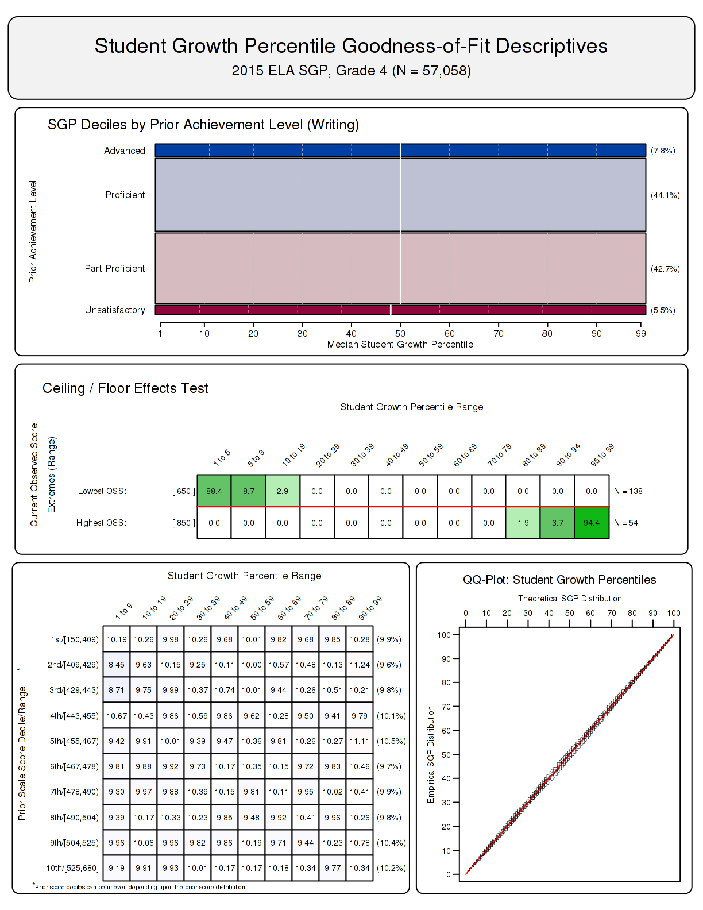
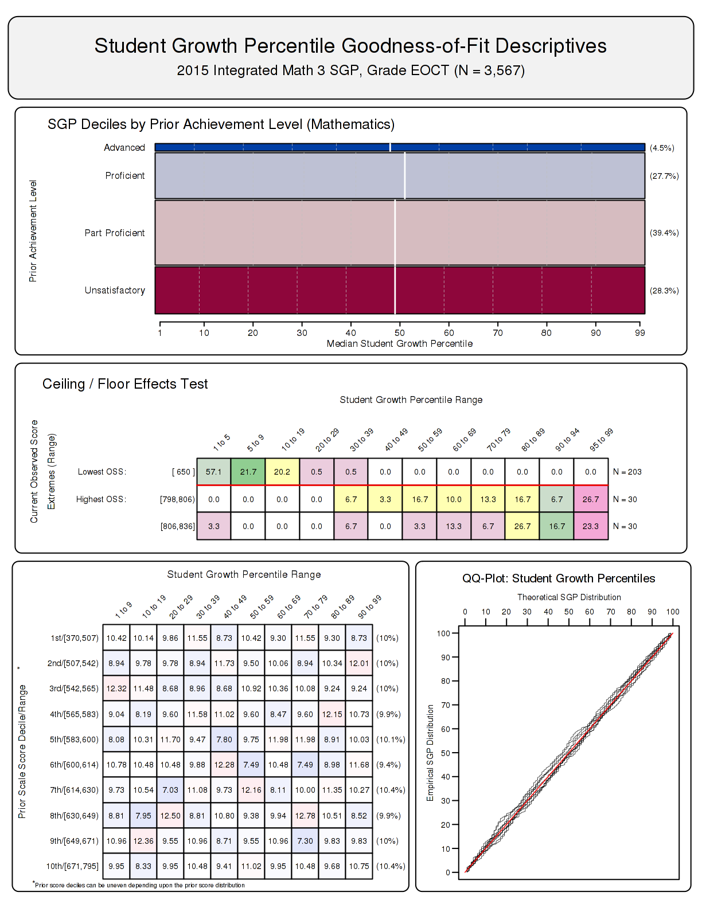

<!--SGPreport-->

<!-- 
This document was written by Damian Betebenner & Adam VanIwaarden for the State of Colorado Department of Education (CDE).

	Original Draft:  April 13, 2016
-->


```{r, echo=FALSE, include=FALSE}
  ## set a universal Cache path
  knitr::opts_chunk$set(cache.path = "_cache/GA_SGP_2015")

  ##  Load some R packages and functions required for HTML table creation silently.  
  ##  Load SGP and other packages here to avoid messages.
  require(SGP)
	require(data.table)
	require(Gmisc)
  require(htmlTable)

  ##  Set Table, Figure and Equation Counters
  options(table_number=0)
  options("fig_caption_no"=0)
	options(fig_caption_no_sprintf = "**Figure %s:**   %s")
	options("fig_caption_no_roman"=FALSE)
	options("equation_counter" = 0)

  ###
	### Lists of Grade Level and EOCT subjects and reference types.  Used to subset summary tables and data below.
	###
																												
  subject_order<-c("ELA", "MATHEMATICS", 
									 "ALGEBRA_I", "ALGEBRA_II", "GEOMETRY", "INTEGRATED_MATH_1", "INTEGRATED_MATH_2", "INTEGRATED_MATH_3")
	GL_subjects <- c("ELA", "MATHEMATICS")
	EOCT_subjects<-c("ALGEBRA_I", "ALGEBRA_II", "GEOMETRY", "INTEGRATED_MATH_1", "INTEGRATED_MATH_2", "INTEGRATED_MATH_3")
```


# Introduction

This report contains details on the 2014-2015 implementation of the student growth percentiles (SGP) model for the state of Colorado.  The National Center for the Improvement of Educational Assessment (NCIEA) contracted with the Colorado Department of Education (CDE) to implement the SGP methodology using data derived from the [Colorado Measures of Academic Success (CMAS)](https://www.cde.state.co.us/communications/factsheetsandfaqs-assessment#cmas)^[CMAS encompasses the Colorado-developed science and social studies assessments as well as the [Partnership for Assessment of Readiness for College and Careers (PARCC)](http://www.parcconline.org/)-developed, English language arts and mathematics assessments] to create the [Colorado Growth Model](https://www.cde.state.co.us/accountability/coloradogrowthmodel).  The goal of the engagement with the CDE is to create a set of open source analytics techniques and conduct a set of initial analyses that will eventually be conducted exclusively by CDE in following years.

The SGP methodology is an open source norm- and criterion-referenced student growth analysis that produces student growth percentiles and student growth projections/targets for each student in the state with adequate longitudinal data.  The methodology is currently used for many purposes.  States and districts have used the results in various ways including parent/student diagnostic reporting, institutional improvement, and school and educator accountability.  Specifics about the manner in which growth is included in school and educator accountability can be found in documents related to those accountability systems.  

This report includes four sections:

- ***Data - *** includes details on the decision rules used in the raw data preparation and student record validation.
- ***Analytics - *** introduces some of the basic statistical methods and the computational process implemented in the 2015 analyses.^[More in-depth treatment of the SGP Methodology can be found [here](https://github.com/CenterForAssessment/SGP_Resources/tree/master/articles).]
- ***Goodness of Fit - *** investigates how well the statistical models used to produce SGPs fit Colorado students' data.  This includes discussion of goodness of fit plots and the student-level correlations between SGP and prior achievement.
- ***SGP Results - *** provides basic descriptive statistics from the 2015 analyses at both the state and school levels.

This report also includes multiple appendices.  Appendix A displays Goodness of Fit plots for each analysis conducted in 2015.  Appendix B provides a more technical description of the SGP methodology and statistical concepts.  Appendix C is an investigation of potential ceiling and/or floor effects present in the Colorado CMAS assessment data and growth analyses.

<!-- HTML_Start -->
<!-- LaTeX_Start 
\pagebreak
LaTeX_End -->

# Data

Data for the Colorado CMAS assessments used in the SGP analyses were supplied by the CDE to the NCIEA for analysis in the Spring of 2016.  The CMAS test records were added to existing Transitional Colorado Assessment Program (TCAP) data from the 2011-2012 through 2013-2014 academic years to create the longitudinal data set from which the 2015 SGPs were calculated.  Subsequent years' analyses will augment this multi-year data set allowing CDE to maintain a comprehensive longitudinal data set for all students taking the CMAS assessments.

Student Growth Percentiles have been produced for students that have a current score and at least one prior score in the same subject or a related content area.  For the 2015 academic year SGPs were produced for grade-level English Language Arts (ELA) and Mathematics, as well as for the Algebra I, Algebra II, Geometry and Integrated Mathematics 1 through 3 end-of-course tests (EOCT) that are included in the CMAS/PARCC assessment program.

## Longitudinal Data

Growth analyses on assessment data require data that are linked to individual students over time.  Student growth percentile analyses require, at a minimum two, and preferably three years of assessment data for analysis of student progress.  To this end it is necessary that a unique student identifier be available so that student data records across years can be merged with one another and subsequently examined.  Because some records in the assessment data set contain students with more than one test score in a content area in a given year, a process to create unique student records in each content area by year combination was required in order to carry out subsequent growth analyses.  Furthermore, student records may be invalidated for other reasons.  

The majority of the selection and invalidation of student records was performed by the CDE.  The following business rules were used by the NCIEA to either invalidate particular student records or select the appropriate record for use in the analyses from the data provided by the CDE after their case selection processes were applied internally.

1.  If a student has multiple records (duplicate from the same subject, grade and administration period), their highest score was selected.
2.  If a student took more than one assessment in the same subject and school year but was identified as being in two different grades, the record with the highest grade level was selected.

Table `r tblNumNext()` shows the number of valid grade level student records available for analysis after applying all case selection business rules.^[This number does not represent the number of SGPs produced, however, because students are required to have at least one prior score available as well.]

```{r, cache=TRUE, echo=FALSE, include=FALSE}
	n_tbl <- table(Colorado_SGP@Data[YEAR=='2015' & VALID_CASE=='VALID_CASE'][, GRADE, CONTENT_AREA])
```
```{r, results='asis', echo=FALSE, N_tableGL}
	n_tbl_GL <- n_tbl[rownames(n_tbl) %in% GL_subjects, -which(colnames(n_tbl)=="EOCT")]
	n_tbl_GL <- n_tbl_GL[match(GL_subjects, row.names(n_tbl_GL)) ,]
	n_tbl_GL <- cbind('Content Area'=sapply(GL_subjects, capwords, special.words=c("ELA")), n_tbl_GL)
	n_tbl_GL <- prettyNum(n_tbl_GL, preserve.width = "individual",big.mark=',')
	n_tbl_GL[which(n_tbl_GL==0)] <- ''
	n_tbl_GL <- n_tbl_GL[, match(c('Content Area', sort(as.numeric(colnames(n_tbl_GL)[-1]))), colnames(n_tbl_GL))]
	row.names(n_tbl_GL) <- NULL

  cat(dualTable(as.matrix(n_tbl_GL), align=paste(rep('r', dim(n_tbl_GL)[2]), collapse=''), 
		n.cgroup=c(1, dim(n_tbl_GL)[2]-1), cgroup=c("", "Grades"),
		caption='Number of Valid Grade Level Student Records by Grade and Subject for 2015'))

```

Table `r tblNumNext()` shows the total number of valid EOCT student records available for analysis after applying all case selection business rules.

```{r, results='asis', echo=FALSE, N_tableEOCT}
	n_tbl_EOCT <- as.matrix(n_tbl[rownames(n_tbl) %in% EOCT_subjects, which(colnames(n_tbl)=="EOCT")], ncol=1)
	n_tbl_EOCT <- as.matrix(n_tbl_EOCT[match(EOCT_subjects, row.names(n_tbl_EOCT)) ,], ncol=1)
	n_tbl_EOCT <- cbind('Content Area'=sapply(EOCT_subjects, capwords, special.words=c("ELA", "II", "III")), 'Valid Records' = n_tbl_EOCT)
	n_tbl_EOCT <- prettyNum(n_tbl_EOCT, preserve.width = "individual",big.mark=',')
	row.names(n_tbl_EOCT) <- NULL

	cat(dualTable(as.matrix(n_tbl_EOCT), align=paste(rep('r', dim(n_tbl_EOCT)[2]), collapse=''), 
		caption='Total Number of Valid EOCT Student Records by Subject for 2015'))
```

<!-- HTML_Start -->
<!-- LaTeX_Start 
\pagebreak
LaTeX_End -->

# Analytics

This section provides basic details about the calculation of student growth percentiles from Colorado CMAS assessment data using the [`R` Software Environment](http://www.r-project.org/) [@Rsoftware] in conjunction with the [`SGP` package](https://github.com/CenterForAssessment/SGP) [@sgp2015].  More in depth treatment of the data analysis process with code examples is available to the CDE staff through [Github](https://github.com/CenterForAssessment/Colorado).

Broadly, the SGP analysis of the Colorado longitudinal student assessment data takes place in two steps:

1. Data Preparation
2. Data Analysis

Those familiar with data analysis know that the bulk of the effort in the above two step process lies with Step 1: Data Preparation.  Following thorough data cleaning and preparation, data analysis using the `SGP` package takes clean data and makes it as easy as possible to calculate, summarize, output and visualize the results from SGP analyses.

## Data Preparation

The data preparation step involves cleaning and processing data provided by the CDE using `R` and producing a `.Rdata` file that will subsequently be analyzed in Step 2. This process is carried out annually as new data become available from the state assessment program.  In 2015 the data cleaning and preparation included:

1.  Change `GRADE` and `CONTENT_AREA` variables to conform to [data conventions used in the `SGP` package](https://github.com/CenterForAssessment/SGP/wiki/SGP-Data-Preparation).
2.  Demographic, institution (school and district) identifiers, and student name variables were edited as necessary to conform to conventions used in the Colorado longitudinal data from previous years' analyses.
3.  Duplicate records (for each student based on grade and/or content area) are invalidated.

The cleaned and formatted data is finally combined with the existing longitudinal data set from previous years' analyses.  The existing data is housed in a new [`SGP` class object](http://cran.r-project.org/web/packages/SGP/SGP.pdf) created from a select subset of TCAP data necessary to complete the 2015 and future CMAS analyses.  With an appropriate longitudinal data set prepared, we move to the calculation and estimation of student-level SGPs.

## 2015 Data Analysis

The objective of the student growth percentile (SGP) analysis is to describe how (a)typical a student's growth is by examining his/her current achievement relative to students with a similar achievement history; i.e his/her *academic peers* (see [this presentation on academic peers](https://github.com/CenterForAssessment/SGP_Resources/blob/master/presentations/Academic_Peer_Slides.pdf) for more information). The estimation of this norm-referenced growth quantity is conducted using quantile regression [@Koenker:2005] to model curvilinear functional relationships between student's prior and current scores.  One hundred such regression models are calculated for each separate analysis (defined as a unique ***year** by **content area** by **grade** by **prior order*** combination).  The end product of these 100 separate regression models is a single coefficient matrix, which serves as a look-up table to relate prior student achievement to current achievement for each percentile. This process ultimately leads to thousands of model calculations during each of Colorado's annual batch of analyses.  For a more in-depth discussion of SGP calculation, see Betebenner [-@Betebenner:2009] and Appendix B of this report for a more in-depth discussion of the SGP estimation methodology.

The 2015 Colorado SGP analyses follow a work flow established in previous years that includes the following 4 steps:

1. Update the Colorado assessment meta-data required for SGP calculations using the `SGP` package.
2. Create annual SGP configurations for analyses.
3. Conduct all SGP analyses concurrently.
4. Combine results into the master longitudinal data set, summarize results and export all data.

### Update Colorado meta-data

The use of higher-level functions included in the `SGP` package (e.g. `analyzeSGP`) requires the availability of state specific assessment information.  This meta-data is compiled in a `R` object named `SGPstateData` that is housed in the package.  The required updates for the 2015 analyses included *a)* the additions of PARCC knots and boundaries, proficiency level cutscores and other configuration metadata, *b)* creating a norm group preferences object and *c)* adding new CMAS related meta-data for the production of individual student reports (ISRs).

<div class='caption'>**Knots and boundaries**</div>
Cubic B-spline basis functions are used in the calculation of SGPs to more adequately model the heteroscedasticity and non-linearity found in assessment data.  These functions require the selection of boundary and interior knots.  Boundary knots (i.e. "boundaries") are end-points outside of the scale score distribution that anchor the B-spline basis.  These are typically selected by extending the entire range of scale scores by 10%.  That is, they are defined as lying 10% below the lowest obtainable/observed scale score (LOSS) and 10% above the highest obtainable/observed scale score (HOSS).  The interior knots (i.e. "knots") are the *internal* breakpoints that define the spline.  The default choice in the `SGP` package is to select the 20<sup>th</sup>, 40<sup>th</sup>, 60<sup>th</sup> and 80<sup>th</sup> quantiles of the observed scale score distribution.

In general the knots and boundaries are computed from a distribution comprised of several years of test data (i.e. multiple combined cohorts) so that any irregularities in a single year are smoothed out.  This is important because subsequent annual analyses use these same knots and boundaries as well.  All defaults were used to compile the knots and boundaries for the TCAP tests in previous years, and were also used in 2015 to compute the CMAS assessments' knots and boundaries using PARCC data from multiple states.  Official knots and boundaries will be recalculated specifically for Colorado CMAS assessments in 2016 when two years of test data are available.

<div class='caption'>**Proficiency level cutscores**</div>
Cutscores, which are set externally by PARCC consortium through standard-setting processes, are mainly required for student growth projections.  Projections were calculated through the use of equating methods in the 2015 analyses due to the switch to the CMAS/PARCC Assessments because Student Growth Projections assume consistency in assessment programs.  However, these projections will not be used for official reporting purposes.

The performance (achievement) level metadata, such as labels and descriptions, were also updated to reflect the new CMAS/PARCC standards.

<div class='caption'>**ISR meta-data**</div>
Finally, meta data for the ISR production was added.  Mainly this entailed updating the `Assessment_Program_Information` and `Student_Report_Information` sections.  The entire 2015 Colorado entry of the `SGPstateData` can be [viewed here.](https://github.com/CenterForAssessment/SGPstateData/blob/a67b31cd2cfb40817d5f842d54ef85be4e3a5e0d/SGPstateData.R#L828)

<div class='caption'>**Set the `sgp.cohort.size` SGP configuration**</div>
Following preliminary analyses, some EOCT course progressions with fewer than 2,000 students were identified as problematic.  Given the inability of models to converge, decreasing quality of model fit, and the increasing difficulty in interpretability of what SGP values from such a small *norm group* size represents, the decision was made to institute a minimum N size of 2,000 students for all analyses.  This could be done either manually by removing the appropriate configuration code, or by adding a `SGP_Configuration` entry for it in the `SGPstateData`.  The latter option was adopted, and therefore any future attempts to examine course progressions with fewer than 2,000 students will require a manual override of this (i.e. set to `NULL`).

<div class='caption'>**Norm group preferences**</div>
The process through which the ELA analyses are run can produce multiple SGPs for some students.  In order to identify which SGP value will be used as the students' "official" SGP and subsequently merged into the master longitudinal data set, a system of norm group preferencing is established and is encoded into a lookup table and included in the `SGPstateData`.  In general, the highest preference is given to progressions with the greatest number of prior scale scores.

The next section describes the process by which the individual course progression analyses are established using configuration code, which incorporates  the preferencing system within it.

### Create SGP configurations

Unlike most grade level analyses, EOCT and ELA analyses are specialized enough so that it is necessary to specify the analyses to be performed via explicit configuration code.  In previous years these configurations were not used because only grade level analyses were run and they do not require configuration scripts when calculated alone^[The `SGP` software will automatically set up configurations for analyses that have a simple data structures: those that follow a numeric grade-level trajectory and use only the same content area for independent and dependent variables].  Their use is required for the ELA analyses because the ELA assessment now covers both reading and writing content, and the analyses use both TCAP Writing and Reading tests as priors.  Although not necessary for the grade level mathematics, the use of configuration code for these analyses in 2015 allowed for greater consistency in the code and for all analyses to be run concurrently.

Configurations are `R` code scripts that are used as part of the larger SGP analysis to be discussed later and to construct the norm group preference object discussed previously.  They are broken up into two separate R scripts based on content domain (ELA and Mathematics).  Each configuration code chunk specifies a set of parameters that defines the norm group of students to be examined.  Every potential norm group is defined by, at a minimum, the progressions of content area, academic year and grade-level.  Therefore, every configuration used contains the first three elements.  The ELA analyses also contain the fourth through sixth elements:

- **`sgp.content.areas`:** A progression of values that specifies the content areas to be looked at and their order.
- **`sgp.panel.years`:** The progression of the years associated with the content area progression (`sgp.content.areas`) provided in the configuration, potentially allowing for skipped years, repeated years, etc.
- **`sgp.grade.sequences`:** The grade progression associated with the content area and year progressions provided in the configuration. **'EOCT'** stands for 'End Of Course Test'.  The use of the generic 'EOCT' allows for secondary students to be compared based on the pattern of course taking rather than being dependent upon grade-level/class-designation.
- **`sgp.exact.grade.progression`:** When set to `TRUE`, this element will force the lower level functions to analyze *only* the progression as specified in its entirety.  Otherwise (either excluded or set to `NULL` or `FALSE`) these functions will analyze subsets of the progression for every possible order (i.e. each number of prior time periods of data available). When set to `TRUE`, a norm group preference system is usually required as well.
- **`sgp.projection.grade.sequences`:** This element is used to identify the grade sequence that will be used to produce straight and/or lagged student growth projections.  It can, somewhat counter-intuitively, be left out or set to NULL, in which case projections will be produced and the package functions will populate the grade sequence to use based on the values provided in the `sgp.grade.sequences` element.  Alternatively, when set to "`NO_PROJECTIONS`", no projections will be produced.  For EOCT analyses, only configurations that correspond to the canonical course progressions can produce student growth projections.  The canonical progressions are codified and stored in the `SGP` package here: `SGPstateData[["CO"]][["SGP_Configuration"]][["content_area.projection.sequence"]]`.
- **`sgp.norm.group.preference`:** Because a student can potentially be included in more than one analysis/configuration, multiple SGPs will be produced for some students and a system is required to identify the preferred SGP that will be matched with the student in the `combineSGP` step.  This argument provides a ranking that specifies how preferable SGPs produced from the analysis in question is relative to other possible analyses.  ***Lower numbers correspond with higher preference.***

As an example, here is one ELA configuration used to define a 2015 SGP analysis:

<!-- HTML_Start -->
<!-- LaTeX_Start 
\pagebreak
LaTeX_End -->

```R
...

  ELA.2015 = list(
    sgp.content.areas=c("READING", "WRITING", "ELA"),
    sgp.panel.years=c( "2014", "2014", "2015"),
    sgp.grade.sequences=list(
      c("3", "3", "4"), c("4", "4", "5"), 
      c("5", "5", "6"), 	c("6", "6", "7"), 
      c("7", "7", "8"), c("8", "8", "9"), 
      c("9", "9", "10"), c("10", "10", "11")),
    sgp.exact.grade.progression = list(rep(TRUE, 8)),
    sgp.projection.grade.sequences = list(
    rep("NO_PROJECTIONS", 8)),
    sgp.norm.group.preference=3),

...

```

### Conduct SGP analyses

All grade level and EOCT SGPs were calculated concurrently.  We use the [`updateSGP`](http://www.inside-r.org/packages/cran/SGP/docs/updateSGP) function to ***a)*** do the final preparation and addition of the 2015 cleaned and formatted data to the `SGP` class object containing the prior years' student data ([`prepareSGP`](http://www.inside-r.org/packages/cran/SGP/docs/prepareSGP) step) and ***b)*** calculate SGP estimates for the grade-level and EOCT subjects ([`analyzeSGP`](http://www.inside-r.org/packages/cran/SGP/docs/analyzeSGP) step) ([`analyzeSGP`](http://www.inside-r.org/packages/cran/SGP/docs/analyzeSGP) step).

### Merge, output, summarize and visualize results

Once all analyses were completed the results were merged into the master longitudinal data set ([`combineSGP`](http://www.inside-r.org/packages/cran/SGP/docs/combineSGP) step).  A pipe delimited version of the complete long data is output ([`outputSGP`](http://www.inside-r.org/packages/cran/SGP/docs/outputSGP) step) and submitted to the CDE.  The data is also summarized using the [`summarizeSGP` function](http://www.inside-r.org/packages/cran/SGP/docs/summarizeSGP), which produces many tables of descriptive statistics that are disaggregated at the state, district and school levels, as well as other factors of interest.  Finally, visualizations (such as bubble charts) are produced from the data and summary tables using the [`visualizeSGP`](http://www.inside-r.org/packages/cran/SGP/docs/visualizeSGP) function.

<!-- HTML_Start -->
<!-- LaTeX_Start 
\pagebreak
LaTeX_End -->

# Goodness of Fit

Despite the use of B-splines to accommodate heteroscedasticity and skewness of the scale score distributions, assumptions that are made in the statistical modeling process can impact how well the percentile curves fit the data.  Examination of goodness-of-fit was conducted by first inspecting model fit plots the `SGP` software package produced for each analysis, and subsequently inspecting student level correlations between growth and achievement.  Discussion of the model fit plots in general and examples of them are provided below, as are tables of the correlation results.  The complete portfolio of model fit plots is provided in Appendix A of this report.

## Model Fit Plots

Using all available grade level and EOCT scores as the variables, estimation of student growth percentiles was conducted for each possible student (those with a current score and at least one prior score).  Each analysis is defined by the grade and content area for the grade-level analyses and exact content area (and grade when relevant) sequences for the EOCT subjects.  A goodness of fit plot is produced for each unique analysis run in 2015 and are all provided in Appendix A to this report.

The "Ceiling/Floor Effects Test" panel is intended to help identify potential problems in SGP estimation at the Highest and Lowest Obtainable (or Observed) Scale Scores (HOSS and LOSS).  If is is relatively typical for extremely high (low) achieving students to consistently score at or near the HOSS (LOSS) each year, the SGPs for these students may be unexpectedly low (high).  That is, for example, if a sufficient number of students maintain performance at the HOSS over time, this performance will be estimated as typical, and therefore SGP estimates will reflect typical growth (e.g. 50th percentile).  In some cases small deviations from these extreme score values might even yield low growth estimates.  Although these score patterns can legitimately be estimated as typical or low growth percentile, it is potentially an unfair description of student growth (and by proxy teacher or school, etc. performance).  Ultimately this is an artifact of the assessments' inability to adequately measure student performance at extreme ability levels.  

The table of values here shows whether the current year scale scores at both extremes yield the expected SGPs^[Note that the prior year scale scores are not represented here, but are also a critical factor in ceiling effects.].  The expectation is that the majority of SGPs for students scoring at or near the LOSS will be low (preferably less than 5 and not higher than 10), and that SGPs for students scoring at or near the HOSS will be high (preferably higher than 95 and not less than 90).  Because few students may score *exactly* at the HOSS/LOSS, the top/bottom 50 students are selected and any student scoring within their range of scores are selected for inclusion in these tables.  Consequently, there may be a range of scores at the HOSS/LOSS rather than a single score, and there may be more than 50 students included in the HOSS/LOSS row if the 50 students at the extremes only contain the single HOSS/LOSS score.

These plots are meant to serve more as a "canary in the coal mine" than as a detailed, conclusive indicator of ceiling or floor effects, and a more fine grained analysis that considers the relationship between score histories and SGPs may be necessary.  Appendix C of this report provides a more in depth investigation.

The two bottom panels compare the estimated conditional density with the theoretical uniform density of the SGPs.  The bottom left panel shows the empirical distribution of SGPs given prior scale score deciles in the form of a 10 by 10 cell grid.  Percentages of student growth percentiles between the 10<sup>th</sup>, 20<sup>th</sup>, 30<sup>th</sup>, 40<sup>th</sup>, 50<sup>th</sup>, 60<sup>th</sup>, 70<sup>th</sup>, 80<sup>th</sup>, and 90<sup>th</sup> percentiles were calculated based upon the empirical decile of the cohort's prior year scaled score distribution^[The total students in each for the analyses varies depending on grade and subject.].  With an infinite population of test takers, at each prior scaled score, with perfect model fit, the expectation is to have 10 percent of the estimated growth percentiles between 1 and 9, 10 and 19, 20 and 29, ..., and 90 and 99.  Deviations from 10 percent, indicated by red and blue shading, suggests lack of model fit.  The further *above* 10 the darker the red, and the further *below* 10 the darker the blue.  

When large deviations occur, one likely cause is a clustering of scale scores that makes it impossible to "split" the score at a dividing point forcing a majority of the scores into an adjacent cell.  This occurs more often in lowest grade levels where fewer prior scores are available (particularly in the lowest grade when only a single prior is available).

The bottom right panel of each plot is a Q-Q plot which compares the observed distribution of SGPs with the theoretical (uniform) distribution.  An ideal plot here will show black step function lines that do not deviate greatly from the ideal, red line which traces the 45 degree angle of perfect fit.

The results in all subjects are excellent with few exceptions (see Appendix A).  As an example, Figure `r getOption("fig_caption_no")+1` shows the results for 4<sup>th</sup> grade ELA as an example of good model fit.  Figure `r getOption("fig_caption_no")+2` is the fit plot for the Integrated Mathematics 3 analysis, which demonstrates minor model misfit.

Minor misfit in the Integrated Mathematics 3 model is likely due in part to the relatively small cohort size.  The indication of a potential ceiling effect in this plot is probably overstated given the range of scores included in the HOSS (bottom) row.  That is, the low SGPs are likely attributed to students scoring just below the HOSS, and therefore less concerning.  This situation is investigated in greater detail in Appendix C of this report.


##### `r figCapNo("Goodness of Fit Plot for 2015 4<sup>th</sup> Grade ELA:  Example of good model fit.")`



##### `r figCapNo("Goodness of Fit Plot for the 2015 Integrated Mathematics 3 Progression: Example of slight model mis-fit.")`


<!-- HTML_Start -->
<!-- LaTeX_Start 
\pagebreak
LaTeX_End -->

## Growth and Prior Achievement at the Student Level

To investigate the possibility that individual level misfit might impact summary level results, student level SGP results were examined relative to prior achievement.  With perfect fit to data, the correlation between students' most recent prior achievement scores and their student growth percentiles is zero (i.e., the goodness of fit tables would have a uniform distribution of percentiles across all previous scale score levels).  To investigate in another way, correlations between **a)** prior and current scale scores (achievement) and **b)** prior achievement and student growth percentiles were calculated.  Evidence of good model fit begins with a strong positive relationship between prior and current achievement, which suggests that growth is detectable and modeling it is reasonable to begin with.  A lack of relationship (zero correlation) between prior achievement and growth confirms that the model has fit the data well and produced a uniform distribution of percentiles across all previous scale score levels.

Student-level correlations for grade level subjects are presented in Table `r tblNumNext()`, and the results are generally as expected.  Strong relationships exist between prior and current scale scores for the grade level analyses (column 3).  With cohort-referenced percentiles, the correlation between students' most recent prior achievement scores and their student growth percentiles is zero when the model is perfectly fit to the data.  This also indicates that students can demonstrate high (or low) growth regardless of prior achievement.  Correlations for Colorado's uncorrected SGPs are all essentially zero (column 4).


### Grade level subjects

```{r, results='asis', echo=FALSE, Student_GL}
	student.cor.grd <- Colorado_SGP@Data[YEAR=='2015' & VALID_CASE=='VALID_CASE' & CONTENT_AREA %in% GL_subjects][, list(
		`$\\\rr_ { Scale Score}$` = round(cor(SCALE_SCORE, SCALE_SCORE_PRIOR_STANDARDIZED, use='pairwise.complete'), 2), 
		`$\\\rr_ {  SGP}$` = round(cor(SGP, SCALE_SCORE_PRIOR_STANDARDIZED, use='pairwise.complete'), 3), 
		N_Size = sum(!is.na(SGP))), keyby = list(CONTENT_AREA, GRADE)]
	
	gl_tmp_tbl <- student.cor.grd[!is.na(student.cor.grd[["$\\\rr_ {  SGP}$"]])]
	gl_tmp_tbl[, GRADE := as.numeric(GRADE)]
	setkey(gl_tmp_tbl, CONTENT_AREA, GRADE)
	gl_tmp_tbl <- gl_tmp_tbl[][order(match(gl_tmp_tbl$CONTENT_AREA, GL_subjects))]

	tmp.cap <- "Grade Level Student Level Correlations between Prior Standardized Scale Score and 1) Current Scale Score and 2) SGP."
	gl_tmp_tbl$CONTENT_AREA <- sapply(gl_tmp_tbl$CONTENT_AREA, capwords, USE.NAMES=FALSE)
	gl_tmp_tbl$CONTENT_AREA[duplicated(gl_tmp_tbl$CONTENT_AREA)] <- ""
	gl_tmp_tbl$N_Size <- prettyNum(gl_tmp_tbl$N_Size, preserve.width = "individual", big.mark=',')
	setnames(gl_tmp_tbl, c(1:2,5), sapply(names(gl_tmp_tbl)[c(1:2,5)], capwords))

  cat(dualTable(as.matrix(gl_tmp_tbl), align=paste(rep('r', dim(gl_tmp_tbl)[2]), collapse=''), caption = tmp.cap))

```

### EOCT Subjects

The EOCT correlations in Table `r tblNumNext()` is disaggregated by their primary constituent norm groups.  Each EOCT subject is potentially analyzed using more than one sequence of prior subjects, grades and years, and these unique progressions are indicated here by the most recent prior available for each norm group (although more prior years' scores are used in SGP calculations when available).  

These correlations between current and prior scale score are notably lower than in the grade level norm groups, and overall lower correlations *may* be expected in EOCT subjects due to the change in specific subject from one course to the next.  Additionally, lower correlations are observed in progressions with smaller cohorts ("N Size").  These are also progressions with later-grade level priors.

The relationships between growth and prior achievement reported in Tables `r tblNumNext()` is still vertually non-existent, which is as expected given appropriate model fit as discussed in the grade level section above.

```{r, cache=TRUE, echo=FALSE, include=FALSE, Student_EOCT}
	student.cor.eoct <- Colorado_SGP@Data[YEAR=='2015' & VALID_CASE=='VALID_CASE' & CONTENT_AREA %in% EOCT_subjects][, list(
		`$\\\rr_ { Scale Score}$` = round(cor(SCALE_SCORE, SCALE_SCORE_PRIOR_STANDARDIZED, use='pairwise.complete'), 2),
		`$\\\rr_ {  SGP}$` = round(cor(SGP, SCALE_SCORE_PRIOR_STANDARDIZED, use='pairwise.complete'), 3),
		N_Size = sum(!is.na(SGP))), keyby = list(CONTENT_AREA, Most_Recent_Prior)]
```
```{r, results='asis', echo=FALSE, Student_EOCT_1}
	eoct_tmp_tbl <- student.cor.eoct[!is.na(student.cor.eoct[["$\\\rr_ {  SGP}$"]])] 

	eoct_tmp_tbl <- eoct_tmp_tbl[][order(match(eoct_tmp_tbl$CONTENT_AREA, EOCT_subjects))]
	eoct_tmp_tbl$CONTENT_AREA <- sapply(eoct_tmp_tbl$CONTENT_AREA, capwords, USE.NAMES=FALSE)

	tmp.cap <- "EOCT Student Level Correlations between Prior Standardized Scale Score and 1) Current Scale Score and 2) SGP - Disaggregated by Norm Group."
	eoct_tmp_tbl[, Most_Recent_Prior := sapply(gsub("/", " ", Most_Recent_Prior), capwords)]
	eoct_tmp_tbl[, Most_Recent_Prior := gsub(" Eoct", "", Most_Recent_Prior)]
	eoct_tmp_tbl[, Most_Recent_Prior := gsub(" 10"," Grade 10",Most_Recent_Prior)]
	eoct_tmp_tbl[, Most_Recent_Prior := gsub(" 9", " Grade 9", Most_Recent_Prior)]
	eoct_tmp_tbl[, Most_Recent_Prior := gsub(" 8", " Grade 8", Most_Recent_Prior)]
	eoct_tmp_tbl[, Most_Recent_Prior := gsub(" 7", " Grade 7", Most_Recent_Prior)]

	eoct_tmp_tbl$CONTENT_AREA <- sapply(eoct_tmp_tbl$CONTENT_AREA, capwords, USE.NAMES=FALSE)
	eoct_tmp_tbl$CONTENT_AREA[duplicated(eoct_tmp_tbl$CONTENT_AREA)] <- ""
	eoct_tmp_tbl$N_Size <- prettyNum(eoct_tmp_tbl$N_Size, preserve.width = "individual", big.mark=',')
	setnames(eoct_tmp_tbl, c(1:2,5), sapply(names(eoct_tmp_tbl)[c(1:2,5)], capwords))

	cat(dualTable(as.matrix(eoct_tmp_tbl), align=paste(rep('r', dim(eoct_tmp_tbl)[2]), collapse=''), caption = tmp.cap))
```

<!-- HTML_Start -->
<!-- LaTeX_Start 
\pagebreak
LaTeX_End -->

# SGP Results

In the following sections basic descriptive statistics from the 2015 analyses are provided, including the state-level mean and median growth percentiles.  Currently Colorado uses cohort-referenced SGPs as the official student-level growth metric.  The CDE may eventually use baseline-referenced SGPs in the future, the transition to the CMAS assessments requires the exclusive use of cohort-referenced analyses for several years until baseline referencing is again feasible.

## Statewide summaries

Growth percentiles, being quantities associated with each individual student, can be easily summarized across numerous grouping indicators to provide summary results regarding growth.  The median and mean of a collection of growth percentiles are used as measures of central tendency that summarize the distribution as a single number.  With perfect data fit, we expect the state median of all student growth percentiles in any grade or subject to be 50 because the data are norm-referenced across all students in the state.  Median (and mean) growth percentiles well below 50 represent growth less than the state "average" and median growth percentiles well above 50 represent growth in excess of the state "average".

To demonstrate the norm-referenced nature of the growth percentiles viewed at the state level, Tables `r tblNumNext()` and  `r tblNumNext()+1` present the cohort-referenced growth percentile medians and means for the grade level and EOCT content areas respectively.

```{r, results='asis', echo=FALSE, SumGL}
	GL_smry <- Colorado_SGP@Data[CONTENT_AREA %in% GL_subjects & YEAR=='2015'][, list(MEDIAN = median(as.numeric(SGP), na.rm=TRUE), MEAN = round(mean(SGP, na.rm=TRUE), 1)), by=c('CONTENT_AREA', 'GRADE')][!is.na(MEDIAN)]
	setkey(GL_smry)

	GL_smryB <- data.frame()
	for (ca in GL_subjects){
		tmp_GL_smry <- paste(t(as.matrix(GL_smry[CONTENT_AREA==ca,][, list(MEDIAN)])), " (", t(as.matrix(GL_smry[CONTENT_AREA==ca,][, list(MEAN)])), ")", sep="")
		tmp_GL_smry <- data.frame(matrix(c(capwords(ca), tmp_GL_smry), 1, length(tmp_GL_smry)+1))
		names(tmp_GL_smry) <- c("Content Area", t(as.matrix(GL_smry[CONTENT_AREA==ca,][, list(GRADE)])))
		GL_smryB <- rbindlist(list(GL_smryB, tmp_GL_smry), fill=TRUE)
	}
	GL_smryB <- sapply(GL_smryB[, match(c('Content Area', sort(as.numeric(colnames(GL_smryB)[-1]))), colnames(GL_smryB)), with=FALSE], as.character)
	GL_smryB[is.na(GL_smryB)] <- ""

  cat(dualTable(GL_smryB, title="", align=paste(rep('r', dim(GL_smryB)[2]), collapse=''), 
  	n.cgroup=c(1, dim(GL_smryB)[2]-1), cgroup=c("", "Grades"),
		caption='2015 Median (Mean) Student Growth Percentile by Grade and Content Area.'))
```

```{r, results='asis', echo=FALSE, SumEOC}
	EOC_smry <- Colorado_SGP@Data[CONTENT_AREA %in% EOCT_subjects & YEAR=='2015'][,list("Median SGP"=median(as.numeric(SGP), na.rm=TRUE), "Mean SGP"=round(mean(SGP, na.rm=TRUE), 1)), by='CONTENT_AREA']
	setkey(EOC_smry)

	EOC_smry_B <- EOC_smry[match(EOCT_subjects, EOC_smry[["CONTENT_AREA"]]) ,]
	EOC_smry_B <- EOC_smry_B[, CONTENT_AREA := sapply(CONTENT_AREA, capwords, special.words=c("II", "US"))]
	setnames(EOC_smry_B, "CONTENT_AREA", "Content Area")
	
  cat(dualTable(as.matrix(EOC_smry_B), align='rcc', 
		caption='2015 EOCT Median and Mean Student Growth Percentile by Content Area.'))
```

Based upon perfect model fit to the data, the median of all state growth percentiles in each grade by year by subject combination should be 50.  That is, in the conditional distributions, 50 percent of growth percentiles should be less than 50 and 50 percent should be greater than 50.  Deviations from 50 indicate imperfect model fit to the data.  Imperfect model fit can occur for a number of reasons, some due to issues with the data (e.g., floor and ceiling effects leading to a "bunching" up of the data) as well as issues due to the way that the SGP function fits the data.  The results in Tables `r tblNum()-1` and `r tblNum()` are close to perfect, with almost all values equal to 50.

The results are coarse in that they are aggregated across tens of thousands of students.  More refined fit analyses are presented in the Goodness-of-Fit section that follows.  Depending upon feedback from CDE, it may be desirable to tweak some operational parameters and attempt to improve fit even further.  The impact upon the operational results based on better fit is expected to be extremely minor.

It is important to note how, at the entire state level, the *norm-referenced* growth information returns little information on annual trends due to its norm-reference nature.  What the results indicate is that a typical (or average) student in the state demonstrates 50<sup>th</sup> percentile growth.  That is, "typical students" demonstrate "typical growth".  One benefit of the norm-referenced results follows when subgroups are examined (e.g., schools, district, demographic groups, etc.) Examining subgroups in terms of the mean or median of their student growth percentiles, it is then possible to investigate why some subgroups display lower/higher student growth than others.  Moreover, because the subgroup summary statistic (i.e., the median) is composed of many individual student growth percentiles, one can break out the result and further examine the distribution of individual results.  


## Group Level Results

Unlike when reporting SGPs at the individual level, when aggregating to the group level (e.g., school) the correlation between aggregate prior student achievement and aggregate growth is rarely zero. The correlation between prior student achievement and growth at the school level is a compelling descriptive statistic because it indicates whether students attending schools serving higher achieving students grow faster (on average) than those students attending schools serving lower achieving students. Results from previous state analyses show a correlation between prior achievement of students associated with a current school (quantified as percent at/above proficient) and the median SGP are typically between 0.1 and 0.3 (although higher numbers have been observed in some states as well). That is, these results indicate that on average, students attending schools serving lower achieving students tend to demonstrate less exemplary growth than those attending schools serving higher achieving students. Equivalently, based upon ordinary least squares (OLS) regression assumptions, the prior achievement level of students attending a school accounts for between 1 and 10 percent of the variability observed in student growth. There are no definitive numbers on what this correlation should be, but recent studies on value-added models show similar results [@MccaLock:2008].

### School Level Results

To illustrate these relationships visually, the bubble charts in Figures `r getOption("fig_caption_no")+1` and `r getOption("fig_caption_no")+2` depict growth as quantified by the median SGP of students at the school against prior achievement status, quantified by percentage of student at/above proficient at the school.  "Prior Percent at/above Proficient" in this case is determined by the percent of student's that scored in the "Proficient" or "Advanced" performance level ranges of the prior year's TCAP test out of all student's that received a score.  The charts have been successful in helping to motivate the discussion of the two qualities: student achievement and student growth.  Though the figures are not detailed enough to indicate strength of relationship between growth and achievement, they are suggestive and valuable for discussions with stakeholders who are being introduced to the growth model for the first time.  Only charts for the grade level subjects are shown here.

```{r, cache=TRUE, echo=FALSE, include=FALSE, BubblePlots}
	#  Need to add in ELA Prior Achievement
	visualizeSGP(Colorado_SGP,
 		plot.types = "bubblePlot",
 		bPlot.years=  "2015",
 		bPlot.content_areas=GL_subjects,
 		bPlot.anonymize=TRUE,
 		bPlot.folder = "../img/Bubble_Plots",
 		bPlot.output = "PNG")
```

##### `r figCapNo("School-level Bubble Plots for Colorado: ELA, 2014-2015.")`
.png)

<p></p>
<p></p>


##### `r figCapNo("School-level Bubble Plots for Colorado: Mathematics, 2014-2015.")`
.png)


<!-- HTML_Start -->
<!-- LaTeX_Start 
\pagebreak
LaTeX_End -->

The relationship between average prior student achievement and median SGP observed for Colorado similar to most other states for which the NCIEA has done SGP analyses.  Table `r tblNumNext()` shows overall correlation between prior achievement (measured here as the mean prior standardized scale score) for the previous three years.  All results shown here are for schools with 15 or more students.

Correlation tables describing the relationship between prior standardized scale score and aggregate growth percentiles are presented below in separate subsections for grade level and EOCT subjects.  The first correlation table in the each subsection provides these overall SGP aggregates' relationships with mean prior standardized scale scores.  The additional correlation tables are disaggregated by content area, and content area and grade to provide more detail.


```{r, cache=TRUE, echo=FALSE, include=FALSE}
	sch.msgp <- Colorado_SGP@Summary$SCHOOL_NUMBER$SCHOOL_NUMBER__YEAR__SCHOOL_ENROLLMENT_STATUS[YEAR != '2012' & !is.na(SCHOOL_NUMBER) & MEDIAN_SGP_COUNT > 14] # Don't include 2012 in 2015
	sch.msgp.subj <- Colorado_SGP@Summary$SCHOOL_NUMBER$SCHOOL_NUMBER__CONTENT_AREA__YEAR__SCHOOL_ENROLLMENT_STATUS[YEAR != '2012' & !is.na(SCHOOL_NUMBER) & MEDIAN_SGP_COUNT > 14]#__
	sch.msgp.grd <- Colorado_SGP@Summary$SCHOOL_NUMBER$SCHOOL_NUMBER__CONTENT_AREA__YEAR__GRADE__SCHOOL_ENROLLMENT_STATUS[YEAR == '2015' & !is.na(SCHOOL_NUMBER) & MEDIAN_SGP_COUNT > 14]
	sch.msgp.grd$CONTENT_AREA <- ordered(sch.msgp.grd$CONTENT_AREA, levels = c(GL_subjects, EOCT_subjects)) #___

	##  Combined subjects - School_Cor_Grand
	sch.cor <- sch.msgp[YEAR != '2012'][, list(
			MEDIAN_SGP = round(cor(MEDIAN_SGP, MEAN_SCALE_SCORE_PRIOR_STANDARDIZED), 2),
			MEAN_SGP=round(cor(MEAN_SGP, MEAN_SCALE_SCORE_PRIOR_STANDARDIZED), 2)), by = 'YEAR']

	##  Multiple year - School_GL_Correlations, School_EOC_Cor
	sch.cor.subj <- data.table(sch.msgp.subj[, list(
			MEDIAN_SGP = round(cor(MEDIAN_SGP, MEAN_SCALE_SCORE_PRIOR_STANDARDIZED), 2),
			MEAN_SGP = round(cor(MEAN_SGP, MEAN_SCALE_SCORE_PRIOR_STANDARDIZED), 2)), by = c('CONTENT_AREA', 'YEAR')]	,
		key=c('CONTENT_AREA', 'YEAR'))


	## 2015 by grade - School_Grade_GL_Correlations
	sch.cor.grd <- sch.msgp.grd[, list(
		MEDIAN_SGP = round(cor(MEDIAN_SGP, MEAN_SCALE_SCORE_PRIOR_STANDARDIZED), 2),
		MEAN_SGP = round(cor(MEAN_SGP, MEAN_SCALE_SCORE_PRIOR_STANDARDIZED), 2)), by = c('CONTENT_AREA', 'GRADE')]
	sch.cor.grd <- sch.cor.grd[order(match(sch.cor.grd$CONTENT_AREA, c(GL_subjects, EOCT_subjects))),]
```

```{r, results='asis', echo=FALSE, School_Cor_Grand}
	tmp_tbl <- data.frame(sch.cor)
	###  Number of "column groups" - here different aggregates correlated with mean standardized prior score
	n_col_group <- c(1,2)  # Just aggregate SGP groups.
	col_group <- c("", "SGP Aggregate Type")
	###  Number of "row groups" - none here  
	n_row_group <- NULL
	row_group <- NULL
	tmp_capt <- "2013 to 2015 Correlations between Mean Prior Standardized Scale Score and Aggregate SGPs - (Combined Subjects)"
	names(tmp_tbl) <- sapply(names(tmp_tbl), capwords)
	tmp_tbl[is.na(tmp_tbl)] <- ""

  cat(dualTable(as.matrix(tmp_tbl), align=paste(rep('r', dim(tmp_tbl)[2]), collapse=''), 
  	n.cgroup=n_col_group, cgroup= col_group, compatibility="CSS", caption= tmp_capt))
   
```

<!-- HTML_Start -->
<!-- LaTeX_Start 
\pagebreak
LaTeX_End -->

<div class='caption'>**Grade Level Content Areas**</div>

```{r, results='asis', echo=FALSE, School_GL_Correlations}
	tmp_tbl <- sch.cor.subj[order(match(sch.cor.subj$CONTENT_AREA, c("READING", "WRITING", GL_subjects))),][CONTENT_AREA %in% c(GL_subjects, "READING", "WRITING")]
	tmp.cap <- "2013 to 2015 School Level Correlations between Mean Prior Standardized Scale Score and Aggregate SGPs by Content Area."	
	tmp_tbl$CONTENT_AREA <- sapply(tmp_tbl$CONTENT_AREA, capwords, USE.NAMES=FALSE)
	tmp_tbl$CONTENT_AREA[duplicated(tmp_tbl$CONTENT_AREA)] <- ""
	setnames(tmp_tbl, sapply(names(tmp_tbl), capwords))

	tmp_tbl[is.na(tmp_tbl)] <- ""

	cat(dualTable(as.matrix(tmp_tbl), align=paste(rep('r', dim(tmp_tbl)[2]), collapse=''), caption  = tmp.cap))
	
```
<p></p>

```{r, results='asis', echo=FALSE, School_Grade_GL_Correlations}
	gl_cor_tbl <- sch.cor.grd[CONTENT_AREA %in% GL_subjects]
	gl_cor_tbl[, GRADE := as.numeric(GRADE)]
	setkey(gl_cor_tbl, CONTENT_AREA, GRADE)

	tmp.cap <- "2015 School Level Correlations between Mean Prior Standardized Scale Score and Aggregate SGPs by Content Area and Grade."
	gl_cor_tbl$CONTENT_AREA <- sapply(gl_cor_tbl$CONTENT_AREA, capwords)
	gl_cor_tbl$CONTENT_AREA[duplicated(gl_cor_tbl$CONTENT_AREA)] <- ""
	setnames(gl_cor_tbl, sapply(names(gl_cor_tbl), capwords))

	cat(dualTable(as.matrix(gl_cor_tbl), align=paste(rep('r', dim(gl_cor_tbl)[2]), collapse=''), caption = tmp.cap))

```

<!-- HTML_Start -->
<!-- LaTeX_Start 
\pagebreak
LaTeX_End -->

<div class='caption'>**End-of-Course Test Subjects**</div>

```{r, results='asis', echo=FALSE, School_EOC_Cor}
	tmp_tbl <- sch.cor.subj[order(match(sch.cor.subj$CONTENT_AREA, EOCT_subjects)),][CONTENT_AREA %in% EOCT_subjects]
	tmp.cap <- "2015 School Level EOCT Correlations between Mean Prior Standardized Scale Score and Aggregate SGPs by Content Area."
	tmp_tbl$CONTENT_AREA <- sapply(tmp_tbl$CONTENT_AREA, capwords, USE.NAMES=FALSE)
	tmp_tbl$CONTENT_AREA[duplicated(tmp_tbl$CONTENT_AREA)] <- ""
	setnames(tmp_tbl, sapply(names(tmp_tbl), capwords))

	tmp_tbl$Year <- NULL # Don't need Year in first year of PARCC
	tmp_tbl[is.na(tmp_tbl)] <- ""

	cat(dualTable(as.matrix(tmp_tbl), align=paste(rep('r', dim(tmp_tbl)[2]), collapse=''), caption = tmp.cap))
```

<!-- HTML_Start -->
<!-- LaTeX_Start 
\pagebreak
LaTeX_End -->

# References
